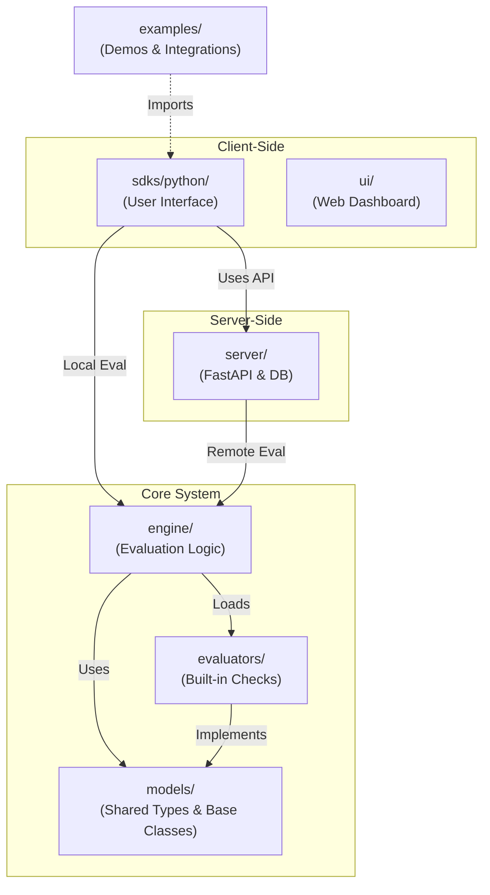

# Contributing to Agent Control

First off, thanks for taking the time to contribute! ❤️

Agent Control is an open source project, and we welcome contributions from the community. Whether you're fixing bugs, adding features, improving documentation, or sharing feedback, your involvement helps make Agent Control better for everyone.

> And if you like the project, but just don't have time to contribute code, that's fine. There are other easy ways to support the project and show your appreciation:
>
> - Star the project on GitHub
> - Share it with colleagues and in your network
> - Reference it in your project's documentation
> - Mention it at meetups or conferences
> - Submit and discuss feature ideas

## Ways to Contribute

There are many ways to help move the project forward:

- **Report Bugs**: Found an issue? Help us fix it by reporting it.
- **Suggest Features**: Have an idea? We'd love to discuss it with you.
- **Improve Documentation**: Help make our docs clearer and more comprehensive.
- **Contribute Code**: Fix bugs, implement features, or add new evaluators.
- **Add Integrations**: Extend Agent Control with new agent framework integrations.

## Contributing Evaluators (Quickstart)

If your goal is to add an evaluator, start here. We support two paths:

| Path | Use when | Location | Install |
| --- | --- | --- | --- |
| Built-in evaluator | Lightweight deps, broadly useful | `evaluators/src/agent_control_evaluators/builtin/` | `pip install agent-control-evaluators` |
| Contrib evaluator | Heavy deps or vendor-specific | `evaluators/contrib/agent-control-evaluator-<org>/` | `pip install agent-control-evaluators[org]` |

**Fast path steps:**

1. Create the evaluator class and config schema.
2. Register the evaluator entry point.
3. Add tests.
4. Add docs.
5. Run `make evaluators-test` (and ideally `make check`).

Full details and examples are in [Adding a New Evaluator](#adding-a-new-evaluator) below.

## Reporting Bugs

Found a bug? Please help us fix it by following these steps:

### 1. Search Existing Issues

Check if the issue already exists in our [GitHub Issues](https://github.com/rungalileo/agent-control/issues). If you find a similar issue, add a comment with additional context rather than creating a duplicate.

### 2. Create a New Issue

If no issue exists, create a new one. When writing your bug report, please include:

- **Clear title and description**: Summarize the problem concisely.
- **Steps to reproduce**: Provide a [minimal, reproducible example](https://stackoverflow.com/help/minimal-reproducible-example) that demonstrates the issue.
- **Expected vs. actual behavior**: Describe what you expected to happen and what actually happened.
- **Environment details**:
  - OS and version (e.g., macOS 14.0, Ubuntu 22.04)
  - Python version
  - Agent Control version
  - Relevant package versions
- **Error messages**: Include full stack traces if applicable.
- **Code snippets**: Share relevant code that triggers the issue.

### 3. Wait for Triage

A project maintainer will review your issue and may ask for additional information. Please be patient as we manage a high volume of issues. **Do not bump the issue unless you have new information to provide.**

If you are adding an issue, please try to keep it focused on a single topic. If two issues are related or blocking, please [link them](https://docs.github.com/en/issues/tracking-your-work-with-issues/using-issues/linking-a-pull-request-to-an-issue) rather than combining them:

```
This issue is blocked by #123 and related to #456.
```

## Suggesting Features

Have an idea for a new feature or enhancement?

### 1. Search Existing Requests

Search the [GitHub Issues](https://github.com/rungalileo/agent-control/issues?q=is%3Aissue+label%3Aenhancement) for existing feature requests.

### 2. Start a Discussion

If no similar request exists, open a new issue with the `enhancement` label. In your feature request:

- **Describe the use case**: Explain the problem you're trying to solve.
- **Explain the value**: Why would this be valuable to other users?
- **Provide examples**: Include mockups, code examples, or references to similar features in other projects.
- **Consider alternatives**: Have you considered other approaches?
- **Outline test cases**: What should be tested to ensure the feature works correctly?

### 3. Await Feedback

Project maintainers and the community will provide feedback. Be open to discussion and iteration on your idea.

## Before You Start Coding

**For significant changes, please open an issue first.** Discussing your proposed changes ahead of time will make the contribution process smooth for everyone. Changes that were not discussed in an issue may be rejected.

For small bug fixes or documentation improvements, you can proceed directly to opening a pull request.

A good first step is to search for [issues labeled "good first issue"](https://github.com/rungalileo/agent-control/issues?q=is%3Aissue+is%3Aopen+label%3A%22good+first+issue%22) or "help wanted". These are specifically marked as suitable for new contributors.

**If you start working on an issue, please comment on it or assign it to yourself to avoid duplicate work.**

## Development Process

Follow these steps to set up your environment and contribute changes.

### 1. Fork and Clone the Repository

1. **Fork** the repository by clicking the "Fork" button on the [Agent Control GitHub page](https://github.com/rungalileo/agent-control).
2. **Clone** your fork locally:
   ```bash
   git clone https://github.com/<your-username>/agent-control.git
   cd agent-control
   ```
3. **Add the upstream remote** (to keep your fork in sync):
   ```bash
   git remote add upstream https://github.com/rungalileo/agent-control.git
   ```

### 2. Set Up Your Development Environment

This project is a Python monorepo managed as a `uv` workspace. We use `make` for common tasks.

**Requirements:**
- Python 3.12+
- `uv` package manager
- `make`

**Setup steps:**

1. **Install dependencies**:
   ```bash
   make sync
   ```
   This installs all workspace dependencies and sets up the development environment.

2. **Install git hooks** (optional but recommended):
   ```bash
   make hooks-install
   ```
   This sets up pre-commit hooks that automatically format and lint your code.

3. **Verify your setup**:
   ```bash
   make check
   ```
   This runs tests, linting, and type checking to ensure everything is working.

### 3. Create a Feature Branch

Create a new branch for your changes. Use descriptive names with prefixes:

- `feature/add-regex-evaluator` - for new features
- `fix/handle-null-agent-name` - for bug fixes
- `docs/improve-evaluator-guide` - for documentation
- `refactor/simplify-core-logic` - for refactoring

```bash
git checkout -b feature/my-new-feature
```

**Keep your branch up to date** with the main branch:
```bash
git fetch upstream
git rebase upstream/main
```

### 4. Make Your Changes

Choose the appropriate package for your changes (see [Project Structure](#project-structure) below):

- **Writing code**: Follow the [code conventions in AGENTS.md](AGENTS.md#code-conventions).
- **Adding tests**: All behavior changes require tests (see [Testing](#testing-your-changes) below).
- **Updating documentation**: Update docstrings, README files, and the `docs/` directory as needed.
- **Adding dependencies**: Use `uv add <package>` in the appropriate workspace package directory.

**Keep your changes focused**: Prefer the smallest diff that fixes the issue. Avoid mixing unrelated changes in a single PR.

### 5. Test Your Changes

Before submitting your PR, ensure all tests pass:

```bash
# Run all checks (tests, lint, typecheck)
make check

# Or run individual checks
make test       # Run all tests
make lint       # Check code style
make typecheck  # Run mypy type checker

# Run tests for a specific package
make engine-test     # Test the engine package
make sdk-test        # Test the SDK
make server-test     # Test the server

# Auto-fix linting issues
make lint-fix
```

**All tests must pass before your PR can be merged.** If you've introduced linter errors, fix them before submitting.

### 6. Commit Your Changes

We use [Conventional Commits](https://www.conventionalcommits.org/) for commit messages:

```bash
feat: add regex pattern evaluator
fix: handle missing agent_id in evaluation
docs: update evaluator implementation guide
refactor: simplify control selector logic
test: add coverage for SQL evaluator edge cases
```

**Commit message format:**
```
<type>: <description>

[optional body]

[optional footer]
```

Common types: `feat`, `fix`, `docs`, `refactor`, `test`, `chore`, `perf`

### 7. Push and Open a Pull Request

1. **Push** your branch to your fork:
   ```bash
   git push origin feature/my-new-feature
   ```

2. **Open a Pull Request** against the `main` branch of the upstream repository.

3. **Fill out the PR template** with:
   - **Title**: Use conventional commit format (e.g., `feat: add regex evaluator`)
   - **Description**: Explain what problem you're solving and how
   - **Issue reference**: Link to related issues (e.g., "Fixes #123", "Closes #456")
   - **Testing**: Describe how you tested the changes
   - **Checklist**: Confirm you've run tests, updated docs, etc.

4. **Wait for review**: A maintainer will review your PR. Be responsive to feedback and questions.

5. **Address review comments**: Make requested changes by pushing new commits to your branch.

6. **Celebrate** when your PR is merged! 🎉

## Common Contribution Scenarios

### Adding a New Evaluator

Evaluators are a core part of Agent Control. Start by choosing a path:

| Path | Use when | Entry point name | Install |
| --- | --- | --- | --- |
| Built-in evaluator | Lightweight deps, broadly useful | `regex`, `sql`, `list` | `pip install agent-control-evaluators` |
| Contrib evaluator | Heavy deps or vendor-specific | `org.evaluator_name` | `pip install agent-control-evaluators[org]` |

**Option A: Built-in evaluator (core package)**

1. Create the evaluator class in `evaluators/src/agent_control_evaluators/builtin/`:

```python
from agent_control_models.evaluator import Evaluator, register_evaluator
from agent_control_models.evaluation import EvaluationResult
from pydantic import BaseModel, Field

class MyEvaluatorConfig(BaseModel):
    """Configuration for the evaluator."""

    pattern: str = Field(description="The pattern to match")

@register_evaluator("my_evaluator")
class MyEvaluator(Evaluator[MyEvaluatorConfig]):
    """A custom evaluator that does X."""

    def evaluate(self, **kwargs) -> EvaluationResult:
        return EvaluationResult(
            passed=True,
            reason="Explanation of the result",
        )
```

2. Register the entry point in `evaluators/pyproject.toml`:

```toml
[project.entry-points."agent_control.evaluators"]
my_evaluator = "agent_control_evaluators.builtin.my_module:MyEvaluator"
```

3. Add tests in `evaluators/tests/test_my_evaluator.py`.
4. Add documentation in `docs/evaluators/my_evaluator.md`.
5. Run tests with `make evaluators-test` and `make check`.
6. Open a PR with your changes.

**Option B: Contrib evaluator (third-party package)**

This path is for evaluators with heavy dependencies (CUDA, large ML libs) or vendor-specific
requirements. Each publisher gets its own package and namespaced entry points.

1. Create a new package under `evaluators/contrib/`:

```
evaluators/
  contrib/
    agent-control-evaluator-acme/
      pyproject.toml
      src/agent_control_evaluator_acme/
      tests/
```

2. Define the package and entry points in
`evaluators/contrib/agent-control-evaluator-acme/pyproject.toml`:

```toml
[project]
name = "agent-control-evaluator-acme"
version = "0.1.0"
dependencies = ["some-heavy-lib"]

[project.entry-points."agent_control.evaluators"]
"acme.toxicity" = "agent_control_evaluator_acme.toxicity:ToxicityEvaluator"
"acme.hallucination" = "agent_control_evaluator_acme.hallucination:HallucinationEvaluator"
```

3. Implement evaluators in `src/agent_control_evaluator_acme/`. Use the same evaluator base
class pattern as Option A and set the decorator name to the namespaced entry point, for example
`@register_evaluator("acme.toxicity")`.
4. Add tests in `evaluators/contrib/agent-control-evaluator-acme/tests/`.
5. Add docs in `docs/evaluators/acme_toxicity.md` (and similar for other evaluators).
6. Add a convenience extra in `evaluators/pyproject.toml`:

```toml
[project.optional-dependencies]
acme = ["agent-control-evaluator-acme>=0.1.0"]
```

7. Ensure the workspace and release config include the new package:

```
pyproject.toml
  [tool.uv.workspace]
  members = ["models", "server", "sdks/python", "engine", "evaluators", "evaluators/contrib/*"]

  [tool.semantic_release]
  version_toml = [
    "evaluators/contrib/agent-control-evaluator-acme/pyproject.toml:project.version",
  ]
```

**Contrib evaluator conventions:**

- Entry points must be namespaced as `org.evaluator_name`.
- A single package can export multiple evaluators.
- Keep heavy or optional dependencies inside the contrib package.
- If optional dependencies exist, override `is_available()` to skip cleanly.

### Adding a New API Endpoint

If you're adding a new server endpoint:

**1. Define or update models** in `models/src/agent_control_models/` if needed:
```python
from pydantic import BaseModel

class MyRequest(BaseModel):
    field: str

class MyResponse(BaseModel):
    result: str
```

**2. Add the endpoint** in `server/src/agent_control_server/endpoints/`:
```python
from fastapi import APIRouter
from agent_control_models.my_models import MyRequest, MyResponse

router = APIRouter()

@router.post("/my-endpoint", response_model=MyResponse)
async def my_endpoint(request: MyRequest) -> MyResponse:
    # Your logic here
    return MyResponse(result="success")
```

**3. Add business logic** in `server/src/agent_control_server/services/` (keep endpoints thin).

**4. Add SDK wrapper** in `sdks/python/src/agent_control/`:
```python
class AgentControlClient:
    def my_method(self, field: str) -> str:
        response = self._request("POST", "/my-endpoint", json={"field": field})
        return response["result"]
```

**5. Add tests** for both server and SDK:
- `server/tests/test_my_endpoint.py`
- `sdks/python/tests/test_my_method.py`

**6. Update documentation** and examples if the endpoint is user-facing.

### Adding an Integration Example

To add an example for a new agent framework:

**1. Create a new directory** in `examples/` (e.g., `examples/my_framework/`).

**2. Add example files**:
- `README.md` - Setup and usage instructions
- `pyproject.toml` - Dependencies for the example
- `.env.example` - Environment variables needed
- Python files demonstrating the integration

**3. Ensure the example is runnable**:
```bash
cd examples/my_framework
uv sync
python main.py
```

**4. Update** `examples/README.md` to include your new example.

### Improving Documentation

Documentation improvements are always welcome:

- **Typos and clarity**: Fix them directly and open a PR.
- **Missing examples**: Add code examples to `docs/` or `examples/`.
- **API documentation**: Update docstrings in the code (they're the source of truth).
- **Architecture guides**: Update `docs/OVERVIEW.md` or other guides.

Run `make check` to ensure your changes don't break anything, then open a PR.

## Pull Request Guidelines

To ensure a smooth review process:

- **Open an issue first** for significant changes to discuss the approach.
- **Keep it focused**: Smaller, focused PRs are easier to review and merge.
- **Follow conventions**: Use [Conventional Commits](https://www.conventionalcommits.org/) for commit messages.
- **Write tests**: All behavior changes require tests (see `docs/testing.md`).
- **Update documentation**: If you change user-facing behavior, update docs.
- **Pass all checks**: Ensure `make check` passes locally before opening the PR.
- **Be responsive**: Address review comments promptly and be open to feedback.

## Testing Your Changes

All tests run in CI and must pass before merging. We follow the testing conventions outlined in `docs/testing.md`.

**Key testing principles:**

- **Behavior changes require tests**: If you modify behavior, add tests that verify the new behavior.
- **Test at the right level**: Unit tests for logic, integration tests for workflows.
- **Use existing patterns**: Review existing tests to understand conventions.
- **Avoid flaky tests**: Tests should be deterministic and reliable.

**Running tests:**

```bash
# Run all tests
make test

# Run tests for a specific package
make engine-test
make sdk-test
make server-test
make evaluators-test

# Run a specific test file
cd engine
uv run pytest tests/test_evaluators.py

# Run a specific test case
uv run pytest tests/test_evaluators.py::test_json_evaluator
```

See `docs/testing.md` for comprehensive testing guidance.

## Acceptable Use of AI Tools

Generative AI can be a useful tool for contributors, but like any tool should be used with critical thinking and good judgment.

We encourage contributors to use AI tools efficiently where they help. However, **AI assistance must be paired with meaningful human intervention, judgment, and contextual understanding.**

**Guidelines:**

- ✅ **Acceptable**: Using AI for boilerplate code, docstrings, test generation as a starting point that you review and refine.
- ✅ **Acceptable**: Using AI to help understand unfamiliar code or concepts.
- ✅ **Acceptable**: Using AI to suggest improvements that you critically evaluate.
- ❌ **Not acceptable**: Submitting entirely AI-generated code without meaningful human review.
- ❌ **Not acceptable**: Mass automated contributions that lack contextual relevance.
- ❌ **Not acceptable**: Low-effort, AI-generated spam PRs.

**If the human effort required to create a pull request is less than the effort required for maintainers to review it, that contribution should not be submitted.**

We will close pull requests and issues that appear to be low-effort, AI-generated spam. With great tools comes great responsibility.

## Project Structure

Understanding the layout will help you know where to make changes. This diagram shows how the different packages interact and where they reside in the repository.



Third-party evaluators live in `evaluators/contrib/` as separate packages and are installed via
extras in `agent-control-evaluators` (for example, `pip install agent-control-evaluators[acme]`).

### Package Descriptions

- **`models/`** (`agent_control_models`): Shared Pydantic v2 models and base classes.
  - Defines API request/response models
  - Base classes for evaluators
  - Shared types used across packages
  - **Change here if**: Adding new API models or evaluator base functionality

- **`engine/`** (`agent_control_engine`): Core evaluation logic and orchestration.
  - Control evaluation engine
  - Evaluator discovery and registration
  - Evaluation orchestration
  - **Change here if**: Modifying evaluation logic or evaluator discovery

- **`server/`** (`agent_control_server`): FastAPI server providing HTTP APIs.
  - REST API endpoints
  - Business logic services
  - Database interactions (Alembic migrations)
  - **Change here if**: Adding new endpoints or server functionality

- **`sdks/python/`** (`agent_control`): Python SDK for users.
  - Client library wrapping server APIs
  - Control decorators and policies
  - Local evaluation support (uses engine)
  - **Change here if**: Adding user-facing SDK features

- **`evaluators/`** (`agent_control_evaluators`): Built-in evaluator implementations.
  - JSON, SQL, regex, list evaluators
  - Luna2 integration
  - All evaluators extend base classes from `models/`
  - Third-party packages live in `evaluators/contrib/` (see [Adding a New Evaluator](#adding-a-new-evaluator))
  - **Change here if**: Adding new evaluators or modifying existing ones

- **`ui/`**: Next.js web application for managing agent controls.
  - TypeScript/React frontend
  - **Change here if**: Adding UI features (separate contribution process)

- **`examples/`**: Runnable examples demonstrating integrations.
  - LangChain, CrewAI, and other framework examples
  - Demo agents and setup scripts
  - **Change here if**: Adding new integration examples

- **`docs/`**: Documentation and architectural guides.
  - `OVERVIEW.md`: Architecture overview
  - `REFERENCE.md`: API reference
  - `testing.md`: Testing conventions
  - Evaluator guides in `docs/evaluators/`
  - **Change here if**: Improving documentation

See `AGENTS.md` for detailed development conventions and the full change map.

## Code Review Process

Once you've opened a pull request:

1. **Automated checks**: CI will run tests, linting, and type checking. All checks must pass.

2. **Maintainer review**: A project maintainer will review your code. This may take a few days depending on the size and complexity of your PR.

3. **Feedback and iteration**: The reviewer may request changes. Please:
   - Address all feedback
   - Push new commits to your branch (don't force-push unless asked)
   - Respond to comments to acknowledge you've addressed them
   - Ask questions if anything is unclear

4. **Approval and merge**: Once approved, a maintainer will merge your PR. We use squash merge to keep history clean, so your commits will be combined into one.

5. **Post-merge**: Your contribution will be included in the next release. Thank you! 🎉

**Review timeline expectations:**
- Simple PRs (docs, small fixes): Usually within 2-3 days
- Complex PRs (new features, evaluators): May take 5-7 days
- We're a small team, so please be patient

If your PR has been waiting more than a week without review, feel free to politely ping in the PR comments.

## Need Help?

If you have questions or need guidance:

- **📚 Read the docs**:
  - `docs/OVERVIEW.md` - Architecture overview
  - `docs/REFERENCE.md` - API reference
  - `docs/testing.md` - Testing conventions
  - `AGENTS.md` - Developer guide for AI coding assistants

- **💡 Check examples**: Review `examples/` for integration patterns.

- **🔍 Search issues**: Your question may have been answered in [existing issues](https://github.com/rungalileo/agent-control/issues).

- **💬 Open a discussion**: For questions that don't fit issues, start a [GitHub Discussion](https://github.com/rungalileo/agent-control/discussions).

- **🐛 Report a problem**: If you're stuck on a bug, [open an issue](https://github.com/rungalileo/agent-control/issues/new) with details.

We appreciate your contribution to making Agent Control better! ❤️

## Quick Reference

### Common Commands

```bash
# Setup and dependencies
make sync                 # Install/sync all dependencies
make hooks-install        # Install git pre-commit hooks

# Development
make dev                  # Run in development mode
make server-run           # Run the server
make check                # Run all checks (tests + lint + typecheck)

# Testing
make test                 # Run all tests
make engine-test          # Test engine package
make sdk-test             # Test SDK package
make server-test          # Test server package
make evaluators-test      # Test evaluators package

# Code quality
make lint                 # Check code style
make lint-fix             # Auto-fix linting issues
make typecheck            # Run mypy type checker

# Database (server)
make server-alembic-upgrade    # Apply database migrations
make server-alembic-downgrade  # Rollback migrations
make server-db-seed            # Seed database with test data
```

### Package Structure

```
agent-control/
├── models/           → agent_control_models
├── engine/           → agent_control_engine
├── server/           → agent_control_server
├── sdks/python/      → agent_control
├── evaluators/       → agent_control_evaluators
├── evaluators/contrib/ → Third-party evaluator packages
├── ui/               → Next.js web app
├── examples/         → Integration examples
└── docs/             → Documentation
```

### Conventional Commit Types

- `feat`: New feature
- `fix`: Bug fix
- `docs`: Documentation changes
- `refactor`: Code refactoring
- `test`: Test additions or changes
- `chore`: Maintenance tasks
- `perf`: Performance improvements

## License

Agent Control is Apache 2.0 licensed. See [LICENSE](LICENSE) for more details.

By contributing to Agent Control, you agree that your contributions will be licensed under the Apache 2.0 License.
