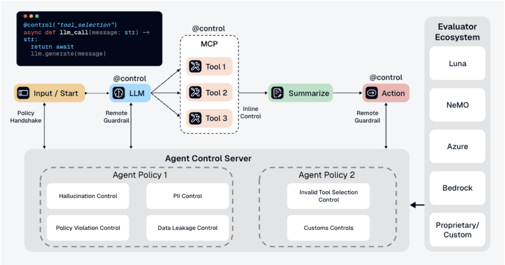

<p align="center">
  
  
</p>

<h1 align="center">Agent Control</h1>

<p align="center">
  <a href="https://opensource.org/licenses/Apache-2.0"></a>
  <a href="https://www.python.org/downloads/"></a>
  <a href="https://pypi.org/project/agent-control-sdk/"></a>
  <a href="https://www.npmjs.com/package/agent-control"></a>
  <a href="https://github.com/agentcontrol/agent-control/actions/workflows/ci.yml"></a>
  <a href="https://codecov.io/gh/agentcontrol/agent-control"></a>
</p>

<p align="center">
  <a href="https://docs.agentcontrol.dev/">Docs</a> |
  <a href="https://docs.agentcontrol.dev/core/quickstart">Quickstart</a> |
  <a href="examples/README.md">Examples</a> |
  <a href="https://join.slack.com/t/agentcontrol/shared_invite/zt-3s2pbclup-T4EJ5sA7SOxR6jTeETZljA">Slack</a>
</p>

Runtime guardrails for AI agents - configurable, extensible, and production-ready.

- Minimal integration - add guardrails with a decorator, callback, or a few lines of SDK code
- Runtime configuration - update controls via API or UI without redeploying
- Pluggable evaluators - built-in or custom
- Framework support - works with LangChain, CrewAI, Google ADK, AWS Strands, and more

## Quick Start

Prerequisites: Docker and Python 3.12+.

The fastest way to try Agent Control is:

1. Start the server
2. Install the SDK
3. Wrap a model or tool call with `@control()`
4. Create controls from the UI or API

### 1. Start the server

No repo clone required:

```bash
curl -L https://raw.githubusercontent.com/agentcontrol/agent-control/refs/heads/main/docker-compose.yml | docker compose -f - up -d
```

This starts PostgreSQL and the Agent Control API at `http://localhost:8000`.

Verify it is up:

```bash
curl http://localhost:8000/health
```

### 2. Install the SDK

Python:

```bash
python3 -m venv .venv
source .venv/bin/activate
pip install agent-control-sdk
```

TypeScript:

- See the [TypeScript SDK example](examples/typescript_sdk/README.md).

### 3. Wrap the part of your agent you want to guard

```python
import agent_control
from agent_control import control

agent_control.init(
    agent_name="customer-support-bot",
    agent_description="Support assistant",
)

@control()
async def answer(message: str) -> str:
    # Replace this with your model or tool call.
    return await llm.ainvoke(message)
```

### 4. Add controls

Choose the path you want:

- Recommended: follow the [full Quickstart](https://docs.agentcontrol.dev/core/quickstart)
- Visual setup: follow the [UI Quickstart](https://docs.agentcontrol.dev/core/ui-quickstart)
- Working code examples: browse [examples/README.md](examples/README.md)

The published `docker-compose.yml` starts the API only. If you also want the local dashboard, use the repo workflow below.

## Local Development

If you want to work on Agent Control itself, clone the repo and use the workspace `make` targets:

```bash
git clone https://github.com/agentcontrol/agent-control.git
cd agent-control
make sync
make server-run
```

To run the UI in a second shell, install Node.js 18+ and `pnpm`, then run:

```bash
make ui-install
make ui-dev
```

- API: `http://localhost:8000`
- UI: `http://localhost:4000`

## How It Works

Agent Control evaluates agent inputs and outputs against controls you configure at runtime. That keeps guardrail logic out of prompt code and tool code, while still letting teams update protections centrally.



## Examples

Start with [Examples Overview](examples/README.md), or jump straight to a few representative examples:

- [Customer Support Agent](examples/customer_support_agent/) - PII protection, prompt injection defense, and tool controls
- [Steer Action Demo](examples/steer_action_demo/) - allow, deny, warn, and steer decisions in one workflow
- [LangChain](examples/langchain/) - protect a SQL agent from dangerous queries
- [CrewAI](examples/crewai/) - combine Agent Control with CrewAI guardrails
- [AWS Strands](examples/strands_agents/) - protect Strands workflows and tool calls
- [Google ADK Decorator](examples/google_adk_decorator/) - add controls with `@control()`

## Performance

| Endpoint | Scenario | RPS | p50 | p99 |
| --- | --- | --- | --- | --- |
| Agent init | Agent with 3 tool steps | 509 | 19 ms | 54 ms |
| Evaluation | 1 control, 500-char content | 437 | 36 ms | 61 ms |
| Evaluation | 10 controls, 500-char content | 349 | 35 ms | 66 ms |
| Evaluation | 50 controls, 500-char content | 199 | 63 ms | 91 ms |
| Controls refresh | 5-50 controls per agent | 273-392 | 20-27 ms | 27-61 ms |

- Agent init handles create and update as an upsert.
- Local laptop benchmarks are directional, not production sizing guidance.

_Benchmarked on Apple M5 (16 GB RAM), Docker Compose (`postgres:16` + `agent-control`)._

## Contributing

See [CONTRIBUTING.md](CONTRIBUTING.md) for contribution guidelines, development workflow, and quality checks.

## License

Apache 2.0. See [LICENSE](LICENSE) for details.
