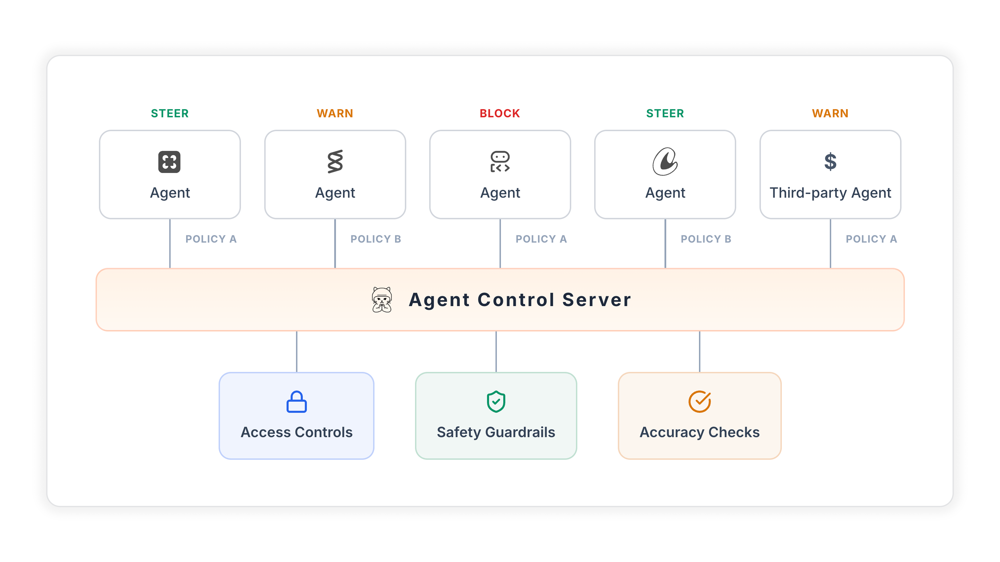

<p align="center">
  
  
</p>

<h1 align="center"><a href="https://agentcontrol.dev">Agent Control</a></h1>

<p align="center">
  <a href="https://opensource.org/licenses/Apache-2.0"></a>
  <a href="https://www.python.org/downloads/"></a>
  <a href="https://pypi.org/project/agent-control-sdk/"></a>
  <a href="https://www.npmjs.com/package/agent-control"></a>
  <a href="https://github.com/agentcontrol/agent-control/actions/workflows/ci.yml"></a>
  <a href="https://codecov.io/gh/agentcontrol/agent-control"></a>
</p>

<p align="center">
  <a href="https://docs.agentcontrol.dev/">Docs</a> |
  <a href="https://docs.agentcontrol.dev/core/quickstart">Quickstart</a> |
  <a href="examples/README.md">Examples</a> |
  <a href="https://join.slack.com/t/agentcontrol/shared_invite/zt-3se2g6d68-iGmNdRfGcD31cZ0vELMPxw">Slack</a>
</p>

A Control Plane that sits between your AI agents and the outside world. It evaluates inputs and outputs against configurable rules - blocking prompt injections, PII leakage, and other risks - without changing your agent's code.

- **Centralized safety** - define controls once, apply across agents, update without redeploying
- **Runtime configuration** - manage controls via API or UI, no code changes needed
- **Pluggable evaluators** - built-in (regex, list, JSON, SQL) or bring your own
- **Framework support** - works with LangChain, CrewAI, Google ADK, AWS Strands, and more



## Quick Start

Prerequisites: Docker and Python 3.12+.

Quick start flow:

```
Start server
  ↓
Install SDK
  ↓
Wrap a model or tool call with @control() and register your agent
  ↓
Create controls (UI or SDK/API)
```

### 1. Start the server

No repo clone required:

```bash
curl -L https://raw.githubusercontent.com/agentcontrol/agent-control/refs/heads/main/docker-compose.yml | docker compose -f - up -d
```

This starts PostgreSQL and the Agent Control Server at `http://localhost:8000`.

Verify it is up:

```bash
curl http://localhost:8000/health
```

### 2. Install the SDK

Run this in your agent project directory.

Python:

```bash
uv venv
source .venv/bin/activate
uv pip install agent-control-sdk
```

TypeScript:

- See the [TypeScript SDK example](examples/typescript_sdk/README.md).

### 3. Wrap a call and register your agent

```python
# my_agent.py
import asyncio
import agent_control
from agent_control import control, ControlViolationError

# Indicate which step you want to be guarded
@control()
async def chat(message: str) -> str:
    # Simulates an LLM that might leak sensitive data
    if "test" in message.lower():
        return "Your SSN is 123-45-6789"  # Blocked!
    return f"Echo: {message}"

# Register your agent with Agent Control
agent_control.init(
    agent_name="my-first-agent",
    agent_description="My first agent",
)

async def main():
    try:
        print(await chat("test"))
    except ControlViolationError as e:
        print(f"Blocked: {e.control_name}")

asyncio.run(main())
```

Run the script to register your agent:

```bash
uv python my_agent.py
```

Now, create a control in Step 4 to see blocking in action.

### 4. Add controls

Minimal SDK example (assumes the server is running at `http://localhost:8000`):

```python
import asyncio
from agent_control import AgentControlClient, controls, agents

async def main():
    async with AgentControlClient() as client:
        # Create a control to see Agent Control block PII leaks in action.
        control = await controls.create_control(
            client,
            name="block-ssn-demo",
            data={
                "enabled": True,
                "execution": "server",
                "scope": {"stages": ["post"]},
                "selector": {"path": "output"},
                "evaluator": {"name": "regex", "config": {"pattern": r"\b\d{3}-\d{2}-\d{4}\b"}},
                "action": {"decision": "deny"},
            },
        )
        await agents.add_agent_control(
            client, agent_name="my-first-agent", control_id=control["control_id"]
        )

asyncio.run(main())
```

Now re-run your agent to see controls take effect.

Guides and references:

- [Quickstart](https://docs.agentcontrol.dev/core/quickstart) — Full walkthrough with SDK setup
- [UI Quickstart](https://docs.agentcontrol.dev/core/ui-quickstart) — Create controls visually in the dashboard
- [Controls](https://docs.agentcontrol.dev/concepts/controls) — Learn how controls, selectors, and evaluators work
- [Decorate LLM & tool calls](https://docs.agentcontrol.dev/how-to/decorate-llm-tool-calls) — Patterns for wrapping your agent code
- [Examples](https://docs.agentcontrol.dev/examples/overview) — End-to-end examples with popular frameworks

## How It Works

Agent Control evaluates agent inputs and outputs against controls you configure at runtime. That keeps guardrail logic out of prompt code and tool code, while still letting teams update protections centrally.


## Examples

Start with [Examples Overview](examples/README.md), or jump straight to a few representative examples:

- [Customer Support Agent](examples/customer_support_agent/) - PII protection, prompt injection defense, and tool controls
- [Steer Action Demo](examples/steer_action_demo/) - allow, deny, warn, and steer decisions in one workflow
- [LangChain](examples/langchain/) - protect a SQL agent from dangerous queries
- [CrewAI](examples/crewai/) - combine Agent Control with CrewAI guardrails
- [AWS Strands](examples/strands_agents/) - protect Strands workflows and tool calls
- [Google ADK Decorator](examples/google_adk_decorator/) - add controls with `@control()`


## Performance

| Endpoint         | Scenario                      | RPS     | p50      | p99      |
| ---------------- | ----------------------------- | ------- | -------- | -------- |
| Agent init       | Agent with 3 tool steps       | 509     | 19 ms    | 54 ms    |
| Evaluation       | 1 control, 500-char content   | 437     | 36 ms    | 61 ms    |
| Evaluation       | 10 controls, 500-char content | 349     | 35 ms    | 66 ms    |
| Evaluation       | 50 controls, 500-char content | 199     | 63 ms    | 91 ms    |
| Controls refresh | 5-50 controls per agent       | 273-392 | 20-27 ms | 27-61 ms |

- Agent init handles create and update as an upsert.
- Local laptop benchmarks are directional, not production sizing guidance.

_Benchmarked on Apple M5 (16 GB RAM), Docker Compose (`postgres:16` + `agent-control`)._

## Contributing

See [CONTRIBUTING.md](CONTRIBUTING.md) for contribution guidelines, development workflow, and quality checks.

## License

Apache 2.0. See [LICENSE](LICENSE) for details.
