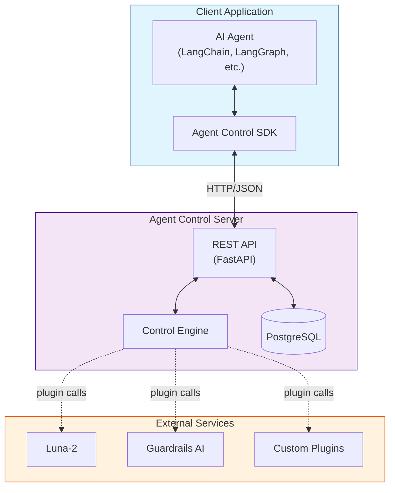
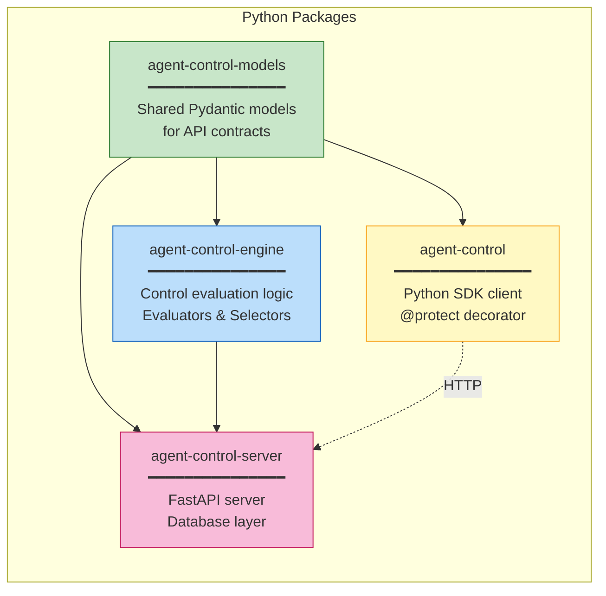

# System Overview

High-level view of Agent Protect architecture showing the main components and how they interact.

## Component Architecture

## Package Structure

## Key Interactions

| From | To | Protocol | Purpose |
|------|-----|----------|---------|
| AI Agent | SDK | In-process | Wrap agent calls with protection |
| SDK | Server | HTTP/JSON | Register agents, evaluate requests |
| Server | Database | SQL | Persist agents, policies, controls |
| Engine | Plugins | In-process | Delegate to external evaluators |
