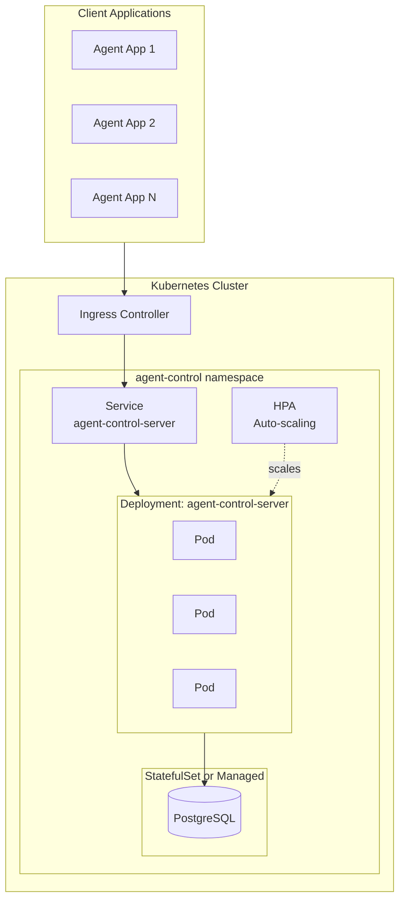
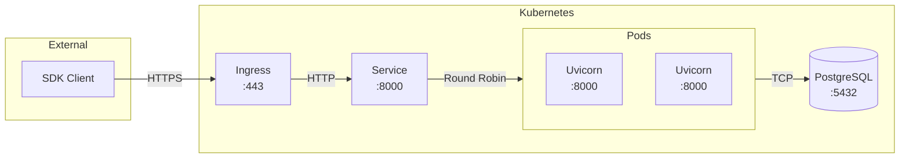
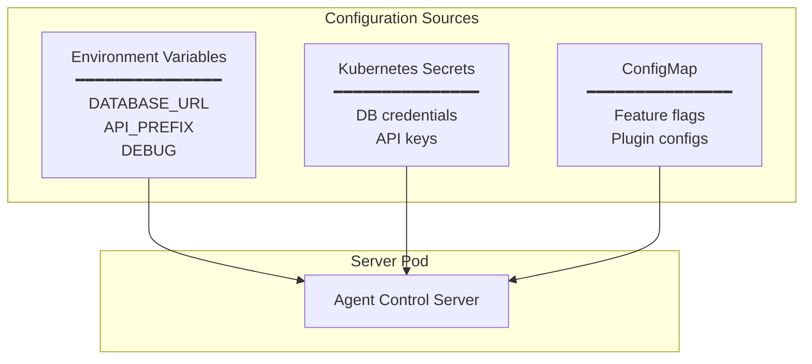

# Deployment Architecture

How Agent Protect components are deployed in a production environment.

## Kubernetes Deployment

## Service Communication

## Configuration

## Endpoints

| Path | Method | Description |
|------|--------|-------------|
| `/health` | GET | Liveness/readiness probe |
| `/api/v1/agents/*` | * | Agent management |
| `/api/v1/policies/*` | * | Policy management |
| `/api/v1/control-sets/*` | * | Control set management |
| `/api/v1/controls/*` | * | Control management |
| `/api/v1/evaluation` | POST | Control evaluation |
