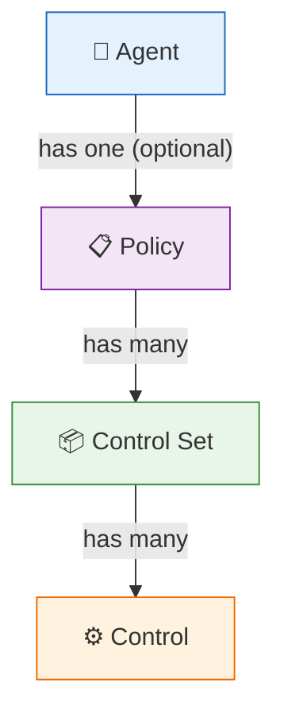
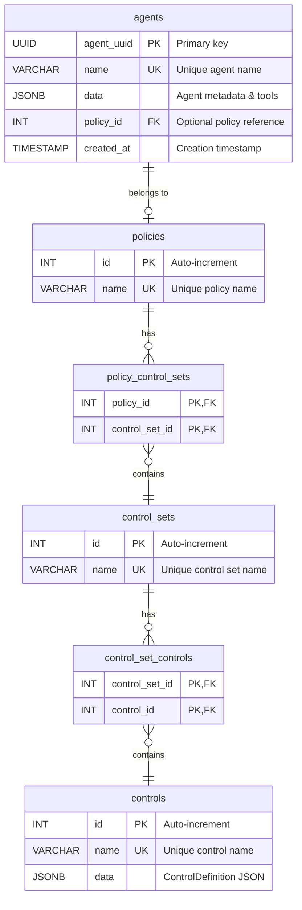
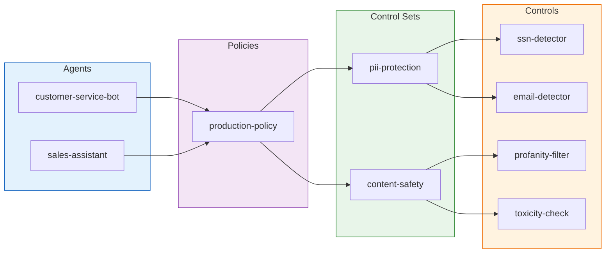

# Entity Relationships

Database schema showing the hierarchical relationship between Agents, Policies, Control Sets, and Controls.

## Entity Hierarchy



## Database Schema (ERD)



## Relationship Details

### Agent → Policy (Many-to-One)
- An Agent can optionally have one Policy assigned
- A Policy can be shared across multiple Agents
- When an Agent has no Policy, it has no active controls

### Policy ↔ Control Set (Many-to-Many)
- A Policy groups multiple Control Sets together
- A Control Set can be reused across multiple Policies
- Association managed via `policy_control_sets` junction table

### Control Set ↔ Control (Many-to-Many)  
- A Control Set groups multiple atomic Controls
- A Control can be reused across multiple Control Sets
- Association managed via `control_set_controls` junction table

## Example Configuration



## Data Traversal

To get all Controls for an Agent:
```
Agent → Policy → ControlSets (via junction) → Controls (via junction)
```

This multi-hop traversal is performed server-side when processing evaluation requests.
