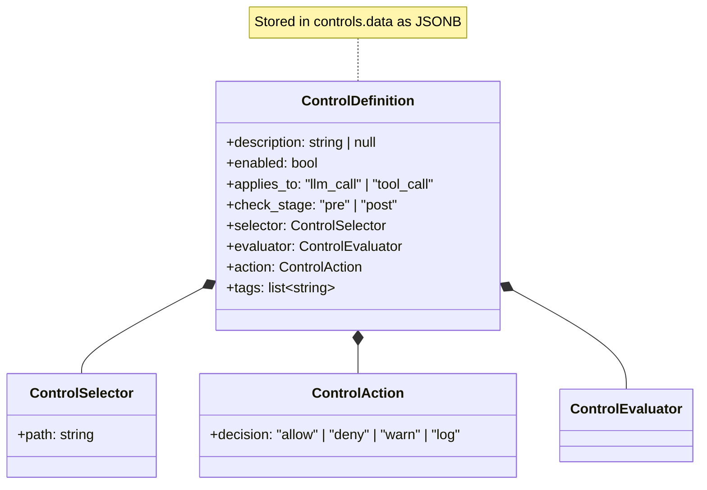
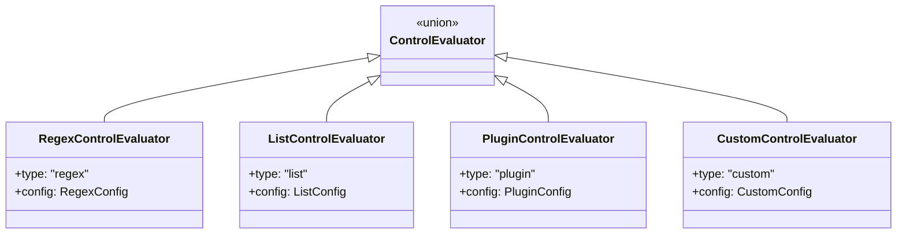
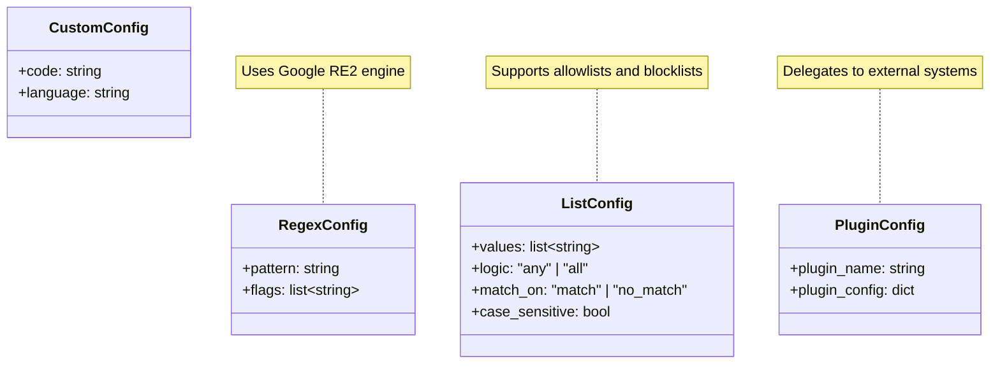
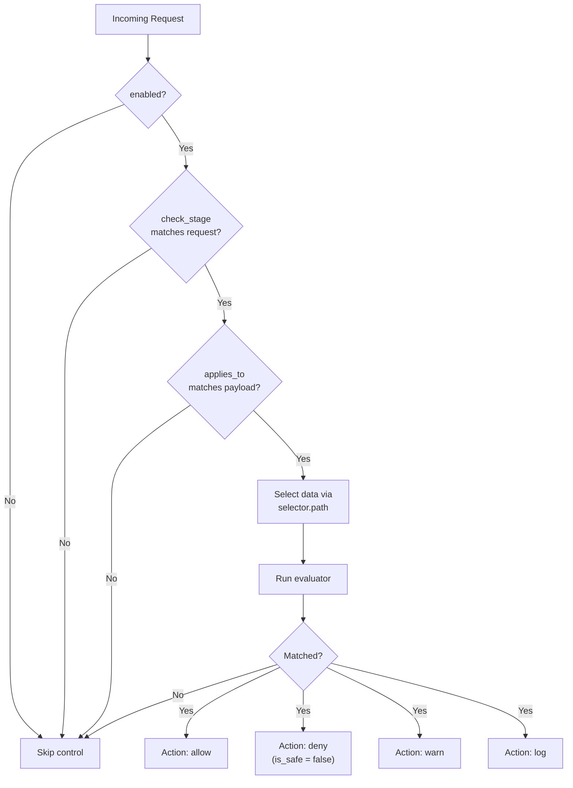

# Control Definition Model

Detailed structure of a Control's configuration stored in the `data` JSONB field.

## ControlDefinition Structure



## Evaluator Types



## Evaluator Configurations



## Control Flow Decision Tree



## Example Control Definition

```json
{
  "description": "Block outputs containing SSN",
  "enabled": true,
  "applies_to": "llm_call",
  "check_stage": "post",
  "selector": {
    "path": "output"
  },
  "evaluator": {
    "type": "regex",
    "config": {
      "pattern": "\\b\\d{3}-\\d{2}-\\d{4}\\b",
      "flags": []
    }
  },
  "action": {
    "decision": "deny"
  },
  "tags": ["pii", "compliance"]
}
```

## Check Stage Semantics

| Stage | When | Use Case |
|-------|------|----------|
| `pre` | Before LLM/tool execution | Validate inputs, block dangerous requests |
| `post` | After LLM/tool execution | Filter outputs, redact PII |

## Applies To Semantics

| Type | Payload | Use Case |
|------|---------|----------|
| `llm_call` | LlmCall (input/output text) | Content moderation, PII detection |
| `tool_call` | ToolCall (tool_name, arguments) | Permission enforcement, input validation |
