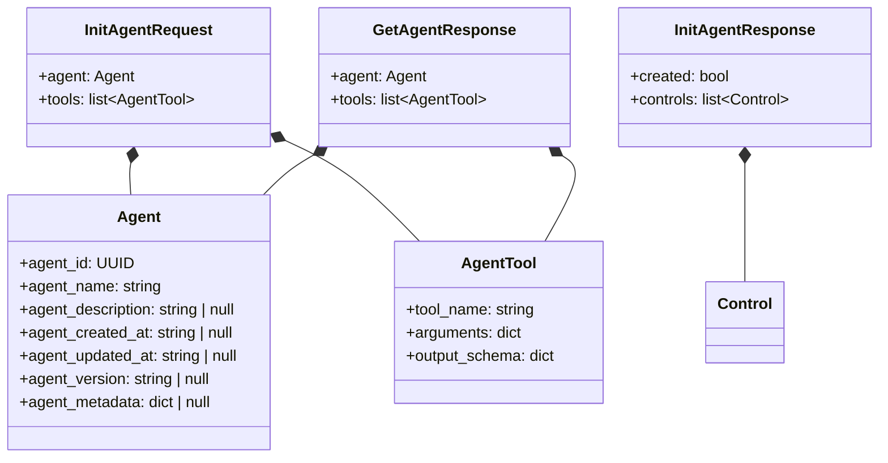
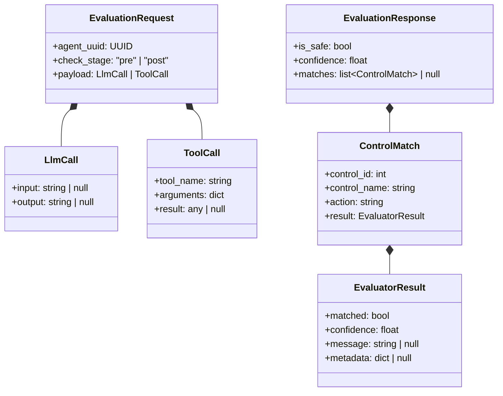
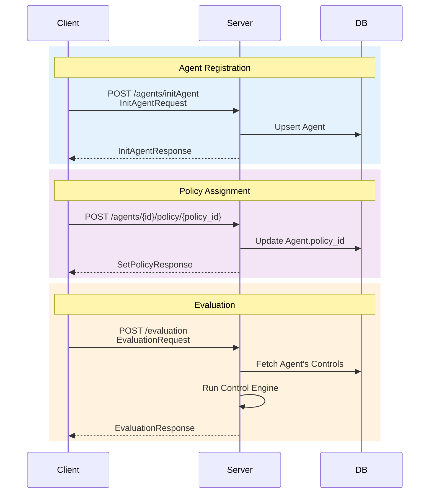
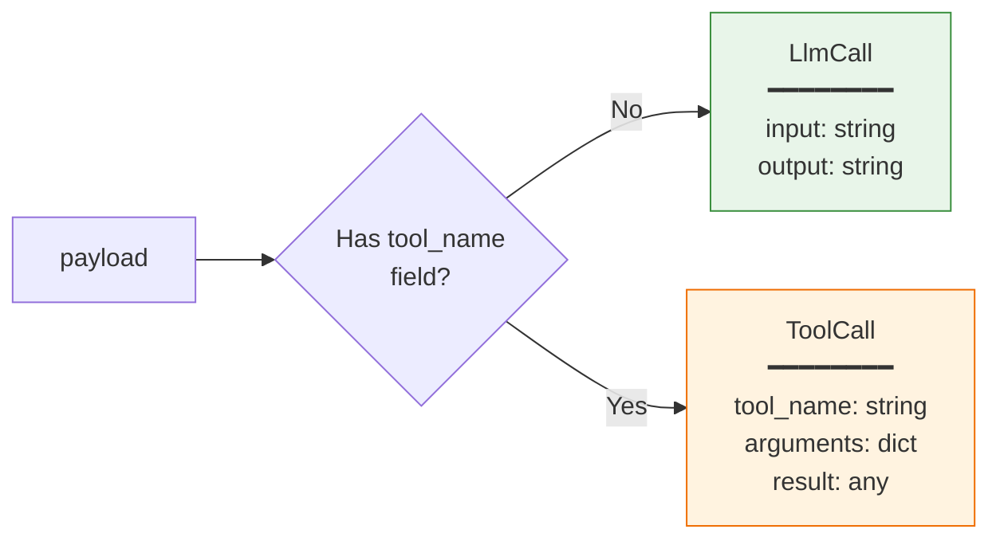
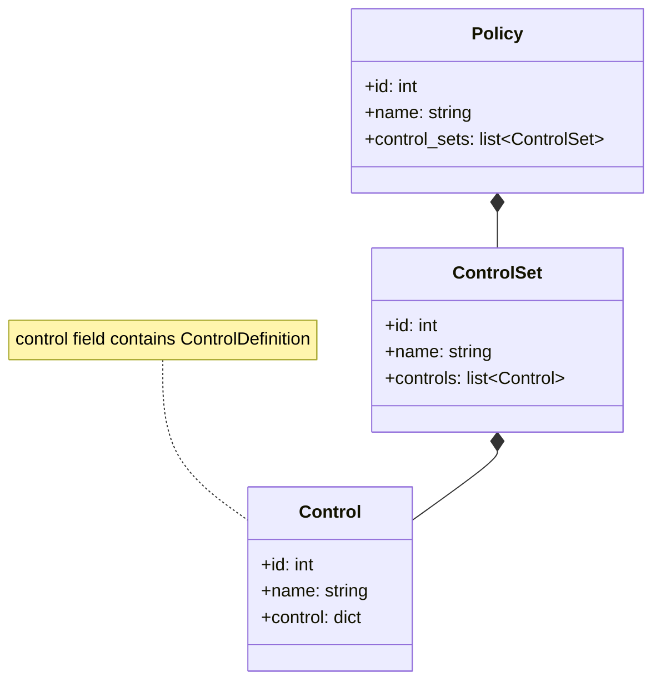

# Request & Response Models

API contracts for the Agent Control Server endpoints.

## Agent Models

## Evaluation Models

## Policy & Control Management Models

```mermaid
classDiagram
    class CreatePolicyRequest {
        +name: string
    }
    class CreatePolicyResponse {
        +policy_id: int
    }

    class CreateControlSetRequest {
        +name: string
    }
    class CreateControlSetResponse {
        +control_set_id: int
    }

    class CreateControlRequest {
        +name: string
    }
    class CreateControlResponse {
        +control_id: int
    }

    class SetControlDataRequest {
        +data: ControlDefinition
    }
    class SetControlDataResponse {
        +success: bool
    }

    class AssocResponse {
        +success: bool
    }

    class SetPolicyResponse {
        +success: bool
        +old_policy_id: int | null
    }
```

## API Request/Response Flow

## Payload Discrimination

The `EvaluationRequest.payload` field is a discriminated union:

## Control Model (API Response)

