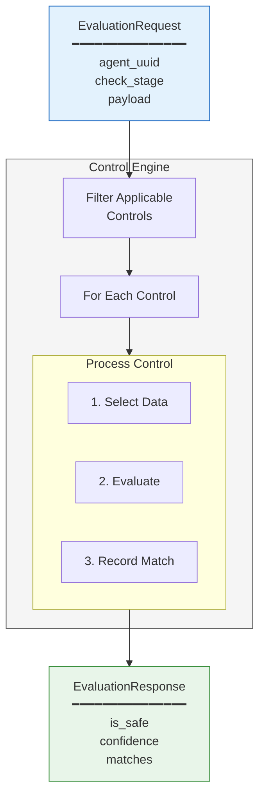
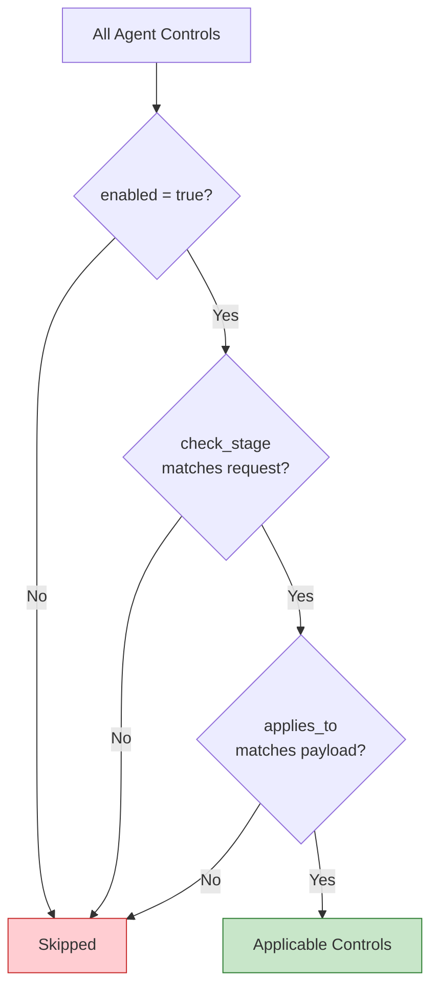
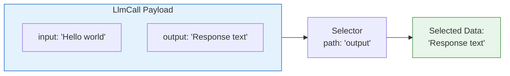
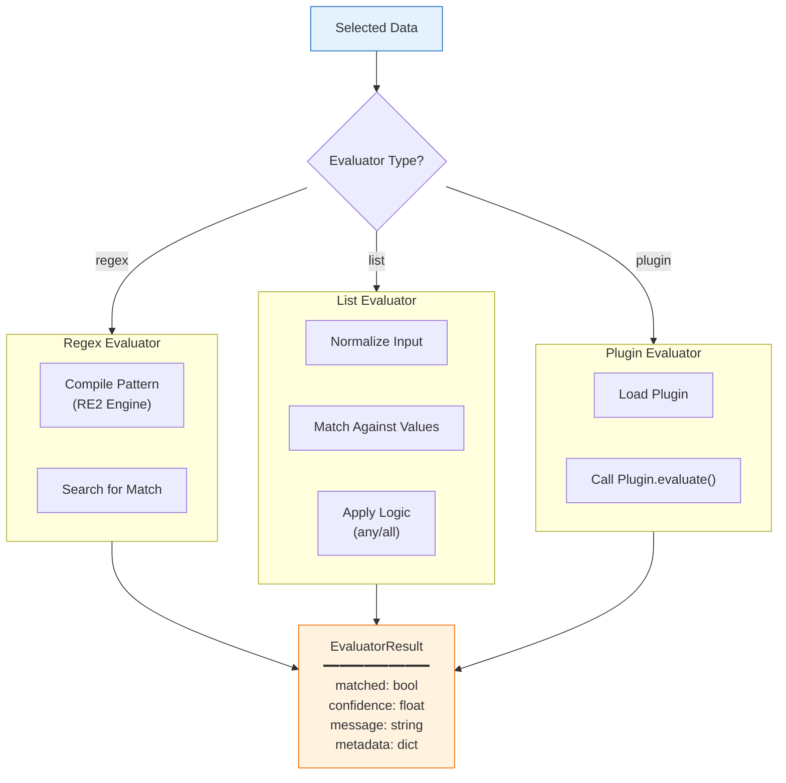
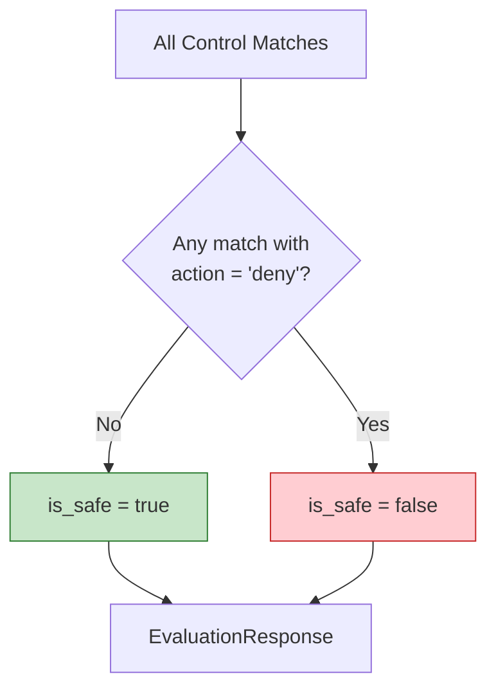
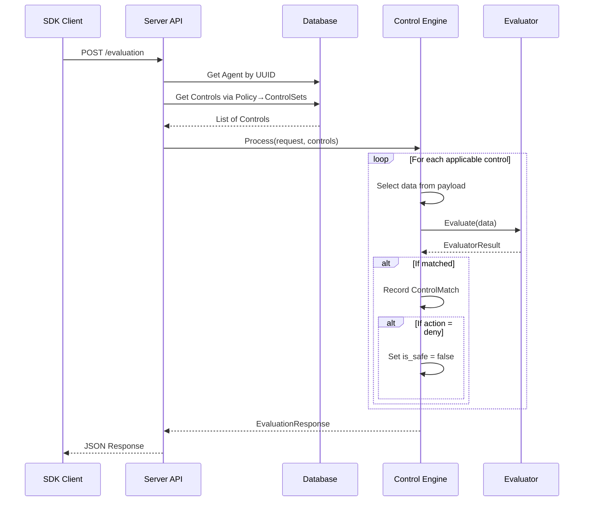
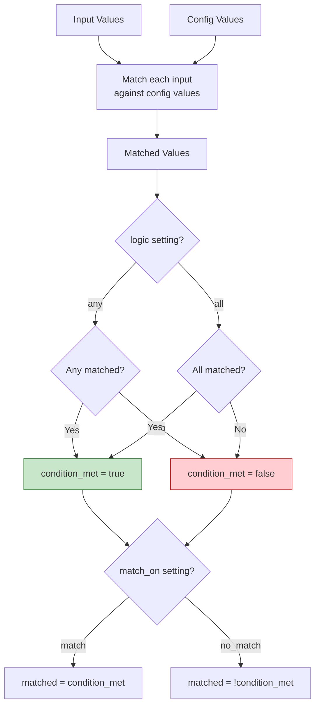

# Control Evaluation Flow

How the Control Engine processes evaluation requests and applies controls.

## High-Level Flow

## Control Filtering Logic

## Data Selection

The Selector extracts data from the payload using a path expression:

## Evaluator Processing

## Result Aggregation

## Complete Sequence

## List Evaluator Logic Detail

