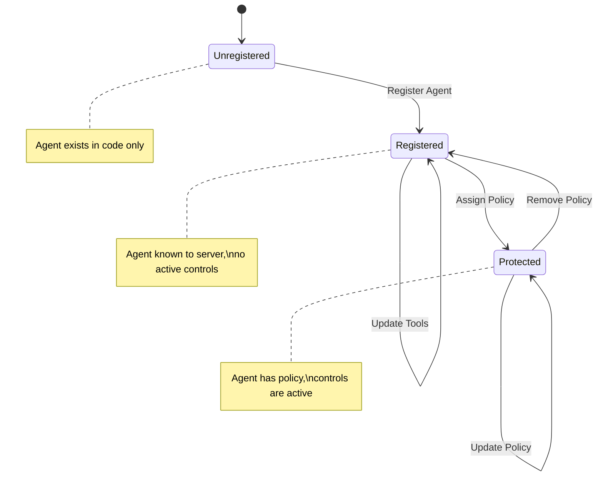
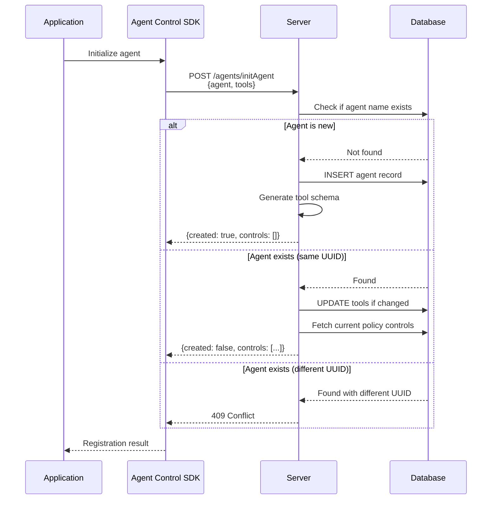
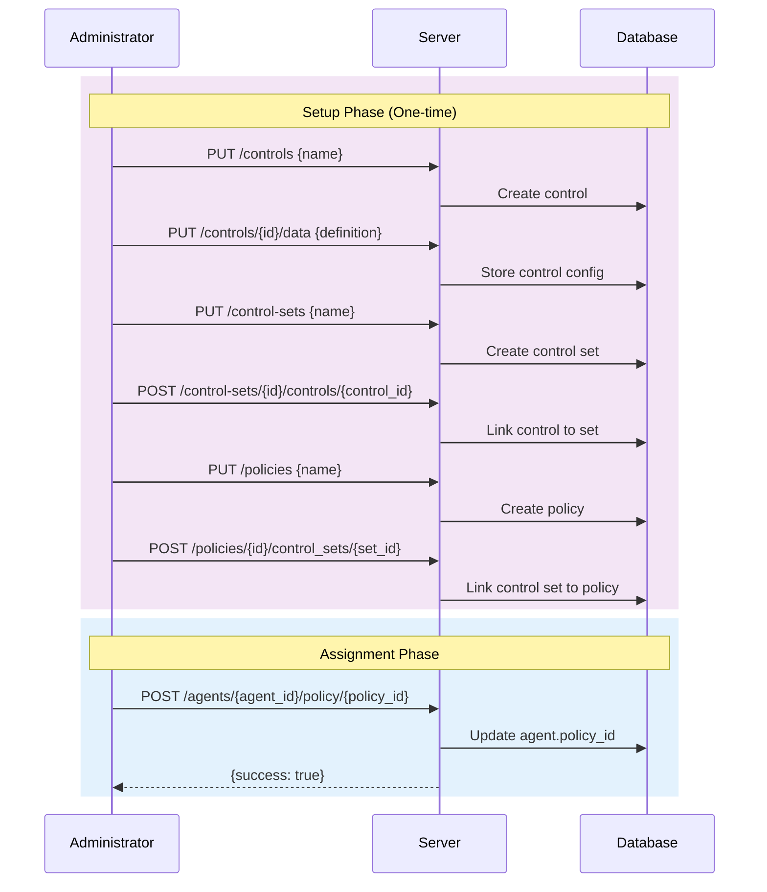
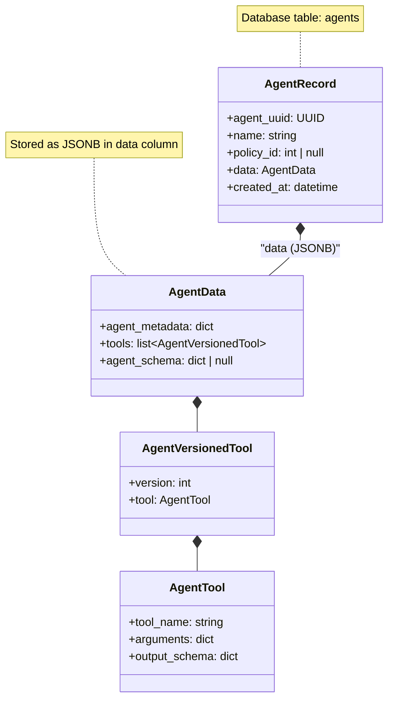
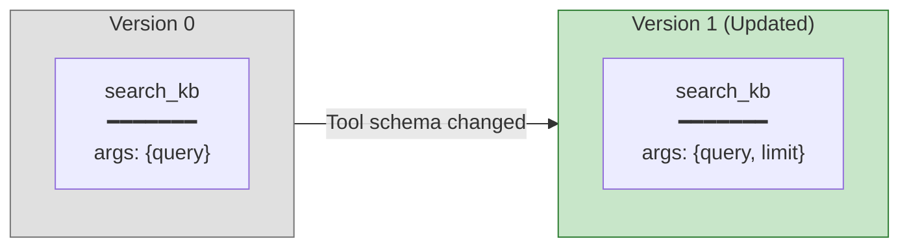
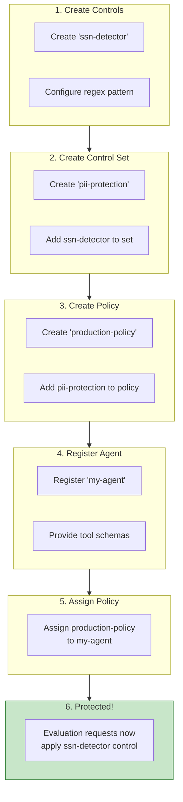

# Agent Lifecycle

How agents are registered, configured, and protected throughout their lifecycle.

## Lifecycle Overview

## Registration Flow

## Policy Assignment Flow

## Agent Data Model

## Tool Versioning

When tools are updated, the system tracks changes:

## Agent States

| State | policy_id | Controls | Evaluation Behavior |
|-------|-----------|----------|---------------------|
| **Unregistered** | N/A | None | Cannot evaluate (404) |
| **Registered** | `null` | None | Always returns `is_safe: true` |
| **Protected** | `<id>` | Active | Applies all policy controls |

## Complete Setup Example

