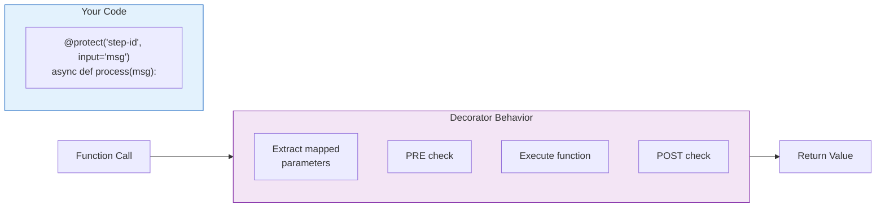
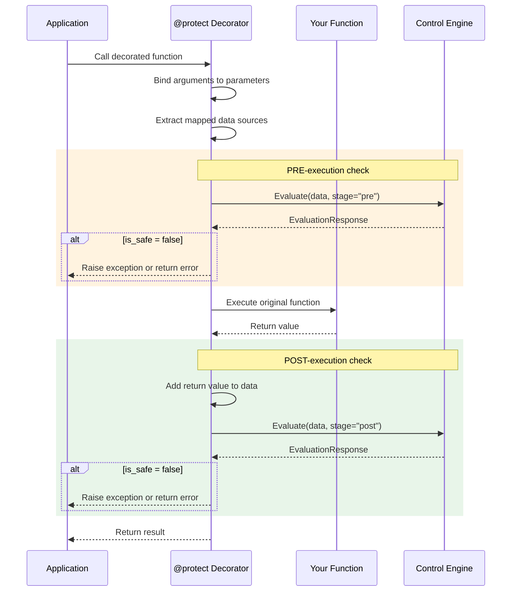
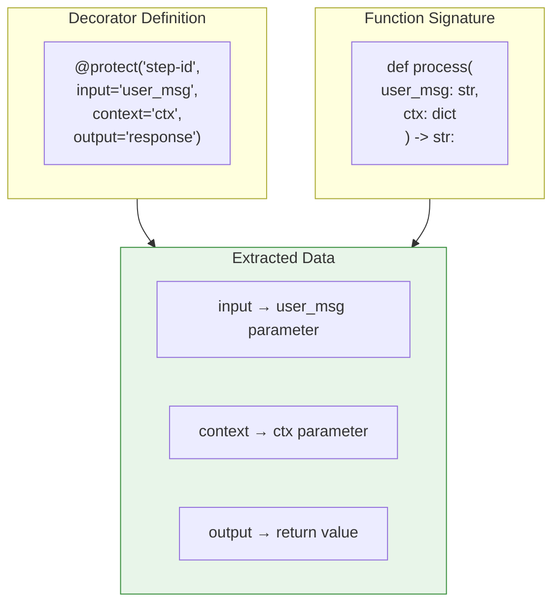
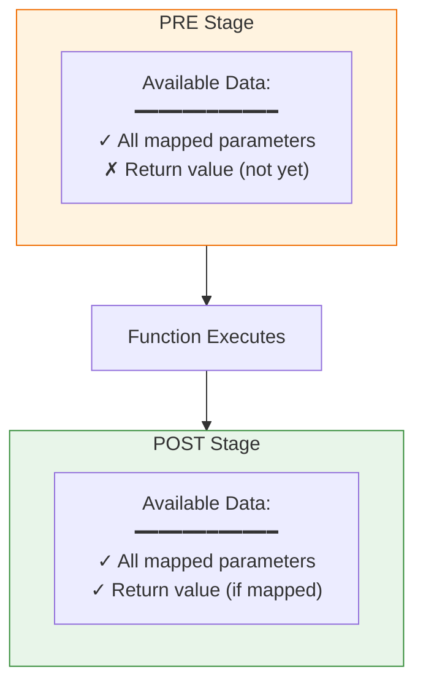
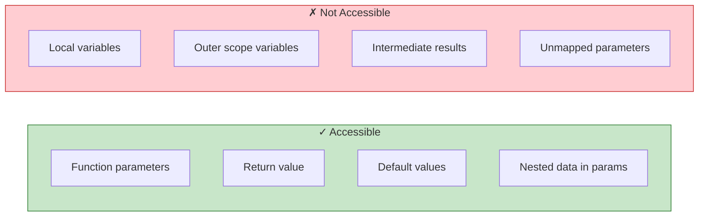
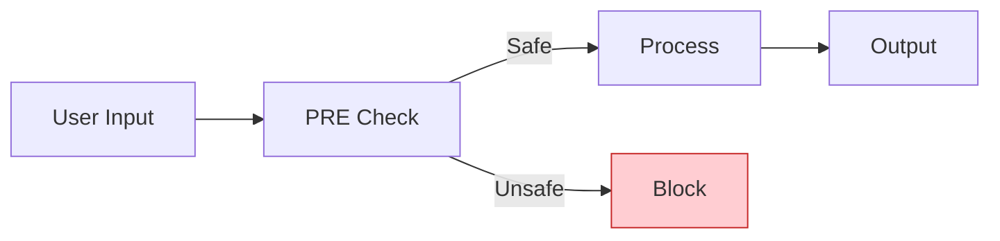
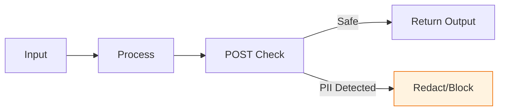
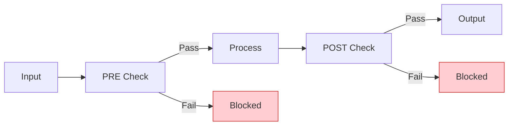
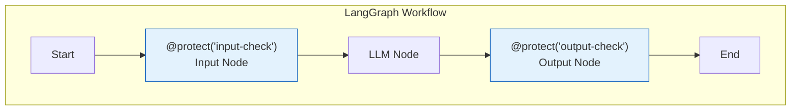
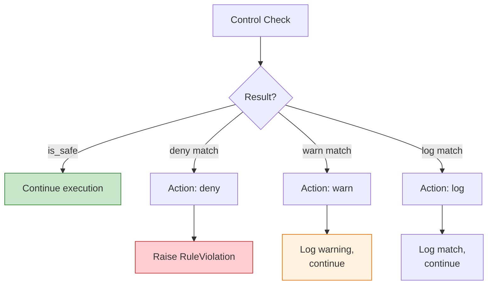

# @protect Decorator Flow

How the SDK's `@protect` decorator intercepts function calls and enforces controls.

## Decorator Overview



## Execution Sequence



## Data Source Mapping



## Parameter Binding Process

```mermaid
flowchart LR
    subgraph call["Function Call"]
        args["process('Hello', {'user': 'A'})"]
    end

    subgraph bind["Signature Binding"]
        sig["signature(process)"]
        bound["bind(*args, **kwargs)"]
        defaults["apply_defaults()"]
    end

    subgraph result["Bound Arguments"]
        ba["user_msg: 'Hello'<br/>ctx: {'user': 'A'}"]
    end

    call --> bind
    bind --> result

    style result fill:#fff3e0,stroke:#ef6c00
```

## Data Available at Each Stage



## What You CAN and CANNOT Access



## Common Patterns

### Pattern 1: Input Validation



### Pattern 2: Output Filtering



### Pattern 3: Full Pipeline



## LangGraph Integration Example



## Error Handling


