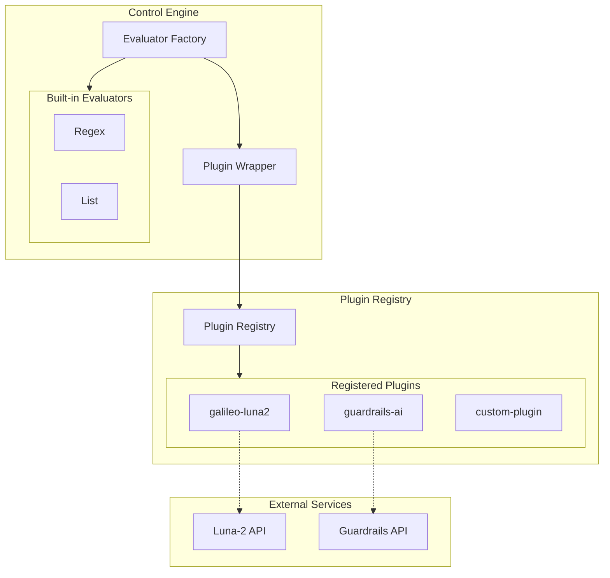
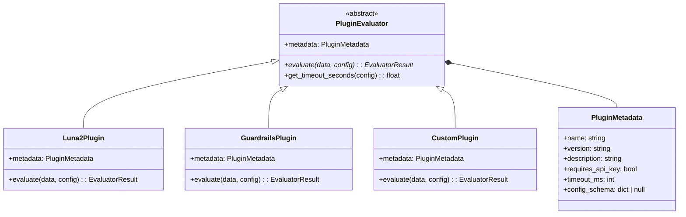
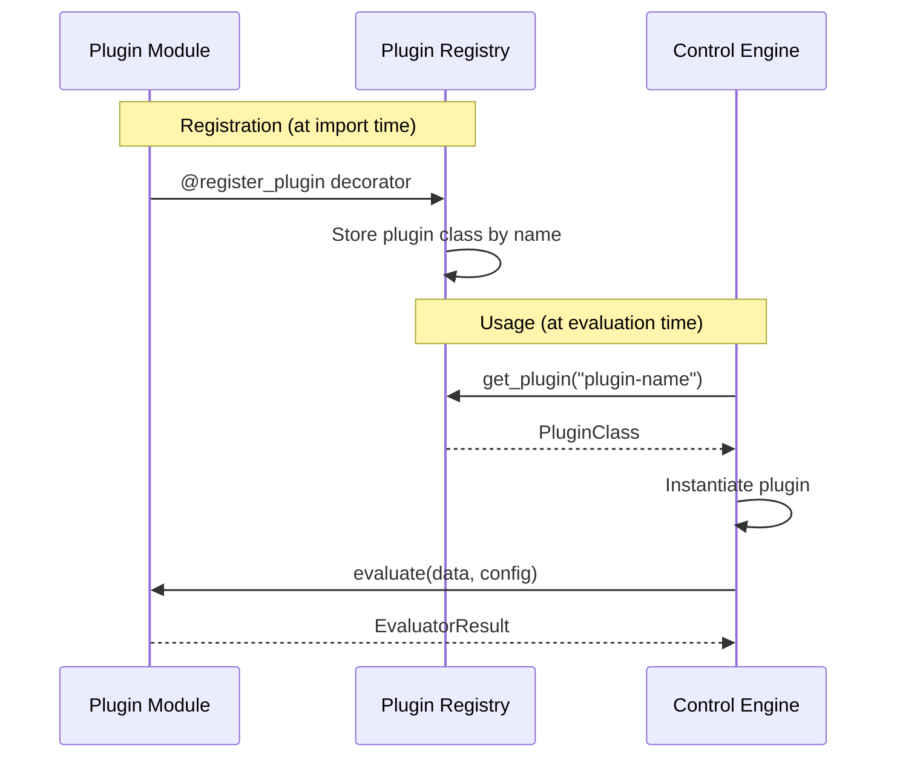
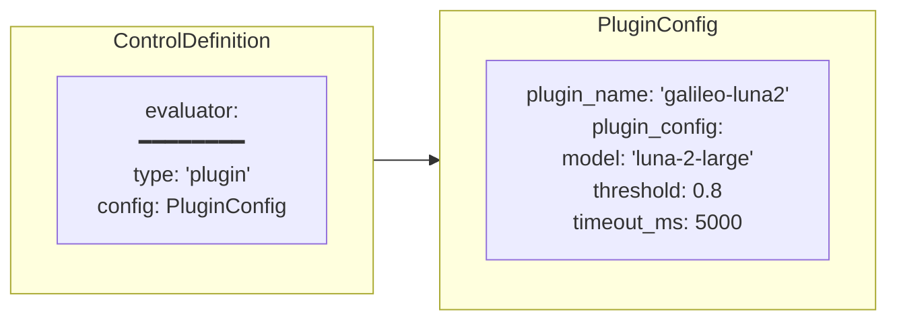
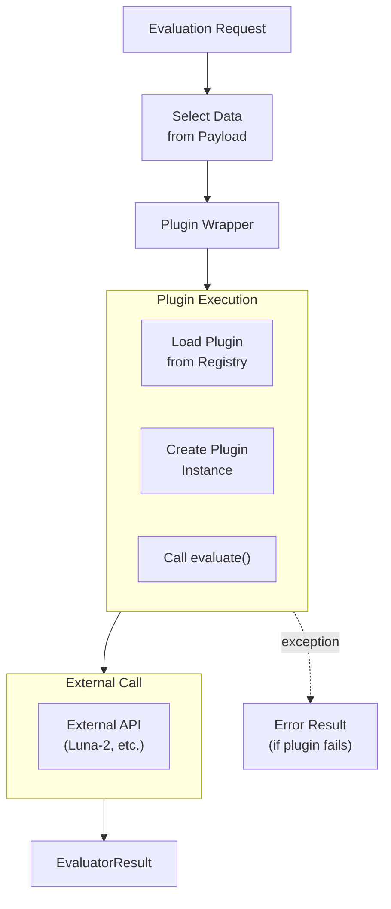
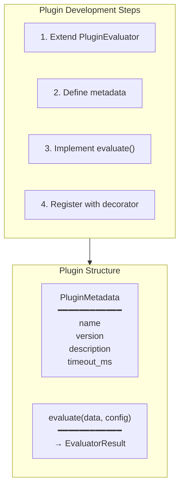
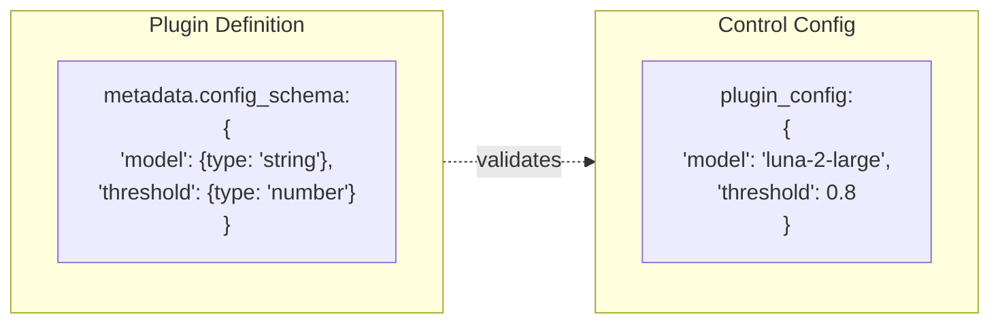
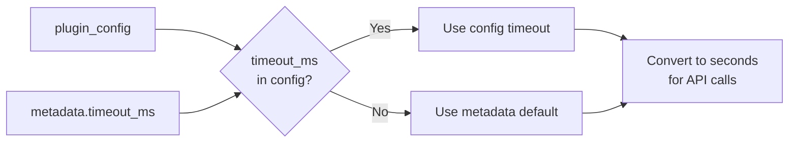

# Plugin System Architecture

How external evaluators integrate with Agent Control through the plugin system.

## Plugin Overview



## Plugin Class Hierarchy



## Plugin Registration Flow



## Plugin Configuration in ControlDefinition



## Plugin Evaluation Flow



## Creating a Custom Plugin



## Plugin Error Handling

```mermaid
flowchart TD
    call["Plugin.evaluate()"]
    
    result{"Success?"}
    
    success["Return EvaluatorResult"]
    
    error["Exception caught"]
    
    error_result["EvaluatorResult<br/>━━━━━━━━━━━━<br/>matched: false<br/>confidence: 0.0<br/>message: error details<br/>metadata: {error: ...}"]

    call --> result
    result -->|Yes| success
    result -->|Exception| error
    error --> error_result
```

## Available Plugins

| Plugin | Description | Requires API Key |
|--------|-------------|------------------|
| `galileo-luna2` | Galileo's Luna-2 safety model | Yes |
| `guardrails-ai` | Guardrails AI validators | Depends |
| Custom | User-defined plugins | Varies |

## Plugin Config Schema

Plugins can define a JSON Schema for their configuration:



## Timeout Handling


