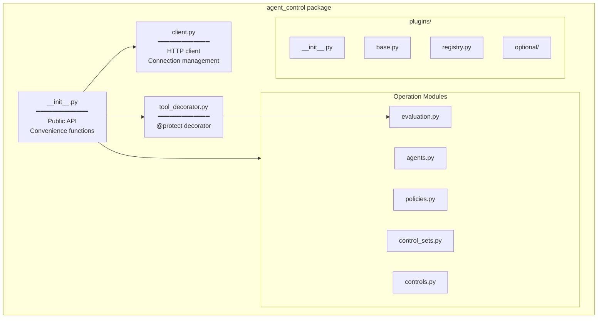
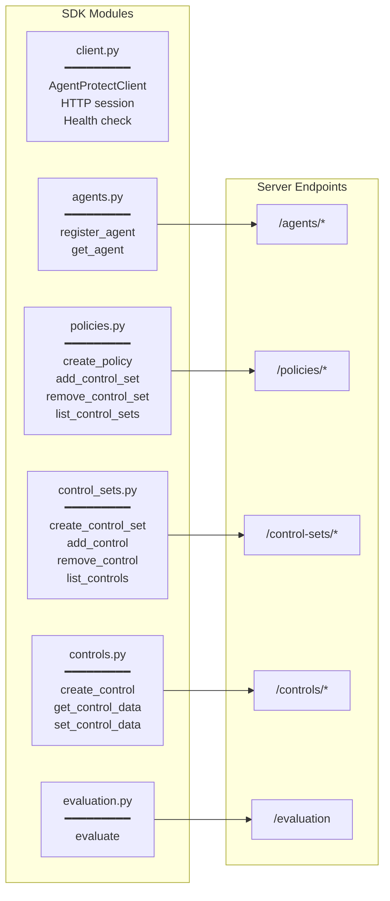
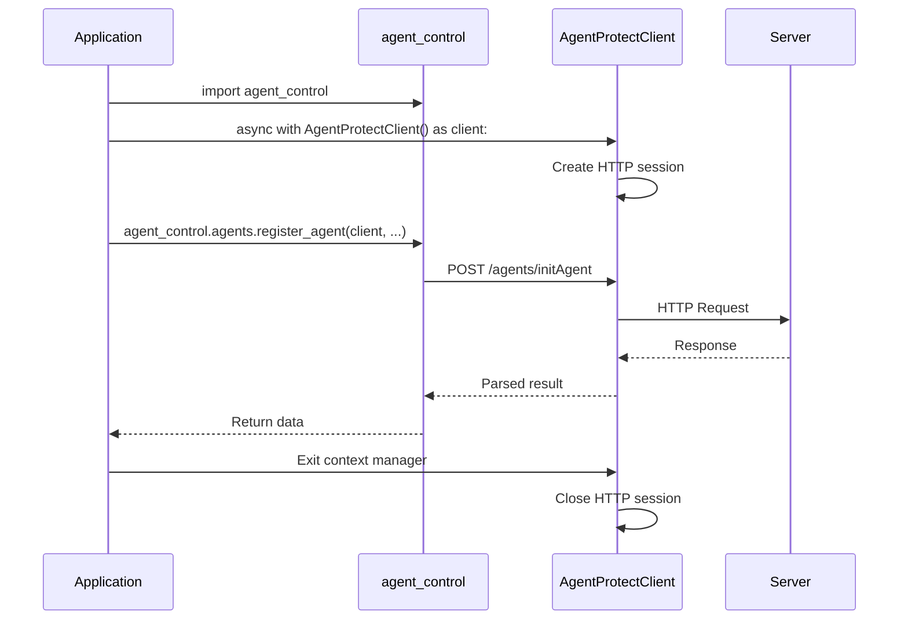
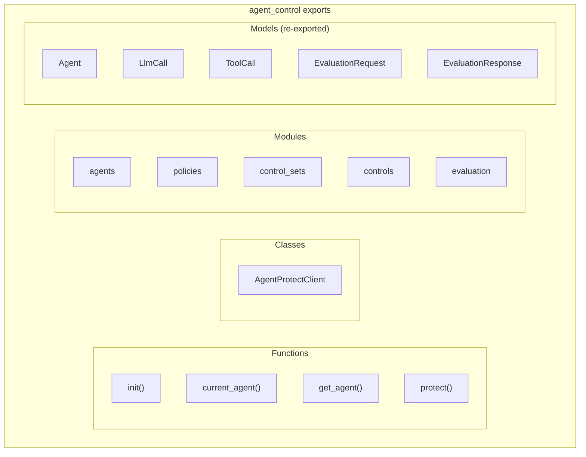
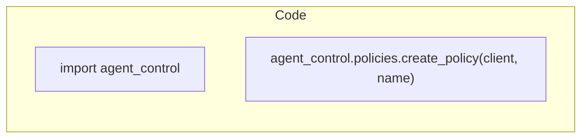
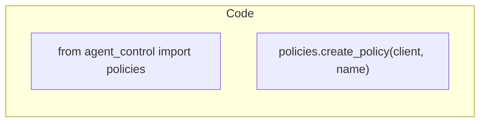
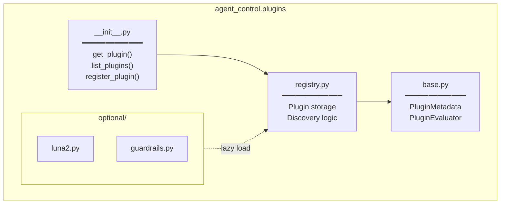
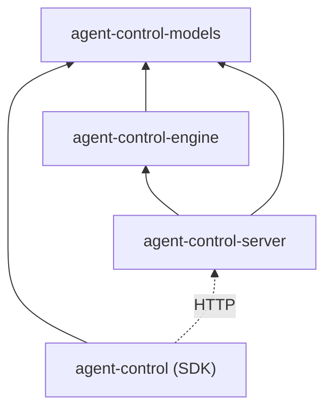
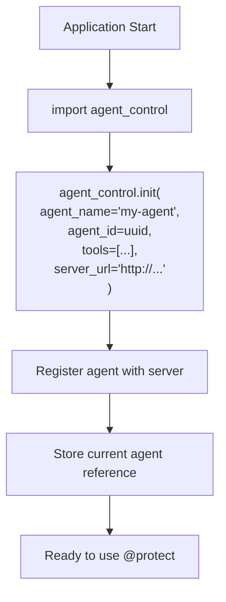

# SDK Architecture

Structure of the Python SDK (`agent-control` package) and how its modules are organized.

## Module Overview



## Module Responsibilities



## Client Usage Pattern



## Public API Exports



## Two Usage Patterns

### Pattern 1: Module-First (Recommended)



### Pattern 2: Direct Import



## Plugin Module Structure



## Dependency Graph



## Initialization Flow



## Error Handling

```mermaid
flowchart TD
    call["SDK API Call"]
    
    http["HTTP Request"]
    
    check{"Response<br/>Status?"}
    
    success["Return parsed data"]
    
    client_error["400-499:<br/>Raise HTTPError"]
    server_error["500-599:<br/>Raise HTTPError"]
    network_error["Connection Error:<br/>Raise Exception"]

    call --> http
    http --> check
    check -->|2xx| success
    check -->|4xx| client_error
    check -->|5xx| server_error
    http -.->|Network| network_error
```
