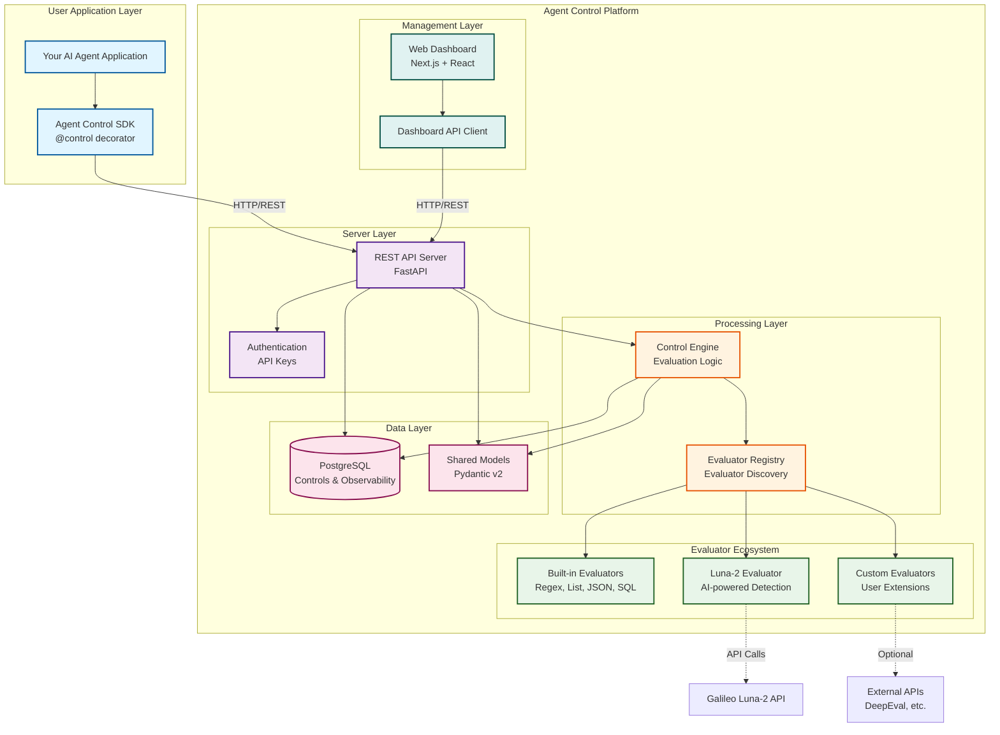

# Agent Control Architecture

## Component Overview

### User Application Layer
- **Your AI Agent Application**: Any Python application using AI agents (LangChain, CrewAI, custom, etc.)
- **Agent Control SDK**: Python package with `@control()` decorator for protecting functions

### Server Layer
- **REST API Server**: FastAPI-based server exposing control management endpoints
- **Authentication**: Optional API key authentication for production deployments

### Processing Layer
- **Control Engine**: Core evaluation engine that processes control rules and evaluates data
- **Evaluator Registry**: Evaluator system for discovering and loading evaluators via entry points

### Evaluator Ecosystem
- **Built-in Evaluators**: Out-of-the-box evaluators (regex, list matching, JSON validation, SQL injection detection)
- **Luna-2 Evaluator**: AI-powered detection using Galileo's Luna-2 API
- **Custom Evaluators**: User-defined evaluators extending the base `Evaluator` class

### Data Layer
- **PostgreSQL**: Persistent storage for controls, agents, and observability data
- **Shared Models**: Pydantic v2 models shared across all components

### Management Layer
- **Web Dashboard**: Next.js + React UI for managing agents and controls
- **Dashboard API Client**: Type-safe API client for frontend-backend communication

## Data Flow

### Control Execution Flow
1. **Function Invocation**: User calls a function decorated with `@control()`
2. **SDK Intercepts**: SDK captures input/output and sends to server
3. **Server Processes**: Server receives request and fetches active controls for the agent
4. **Engine Evaluates**: Engine runs applicable evaluators based on control configuration
5. **Decision Made**: Engine returns allow/deny decision with metadata
6. **SDK Enforces**: SDK either allows execution or raises `ControlViolationError`

### Control Management Flow
1. **User Configures**: Admin uses Web Dashboard or API to create/modify controls
2. **Server Stores**: Server validates and stores control configuration in database
3. **Runtime Updates**: Changes take effect immediately for new requests (no deployment needed)
4. **Observability**: All control executions are logged for monitoring and analysis

## Key Features

- **Runtime Configuration**: Update controls without redeploying applications
- **Extensible**: Evaluator architecture for custom evaluators
- **Fail-Safe**: Configurable error handling (fail open/closed)
- **Observable**: Full audit trail of control executions
- **Production-Ready**: API authentication, PostgreSQL, horizontal scaling support
