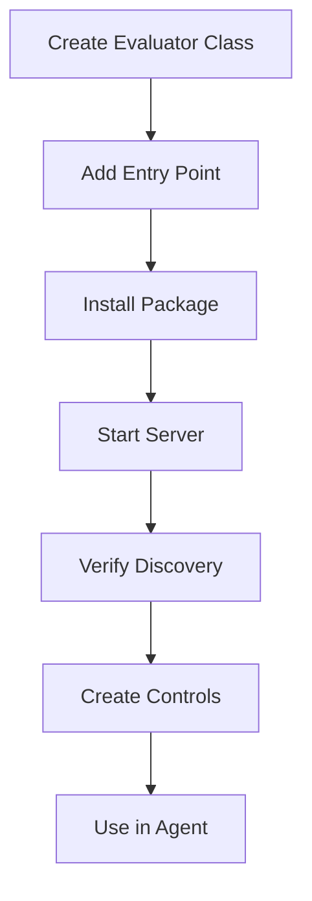

# Third-Party Developer Guide: Creating Custom Evaluators

This guide shows the complete, end-to-end process for third-party developers to create custom evaluators, register them with the agent-control server, and use them in their agents.

## Overview

The DeepEval example demonstrates the complete workflow:

1. **Create the custom evaluator** - Extend the `Evaluator` base class
2. **Register via entry points** - Make the evaluator discoverable by the server
3. **Install the package** - Install locally or publish to PyPI
4. **Verify server discovery** - Confirm the server recognizes your evaluator
5. **Create controls** - Define controls that use your evaluator
6. **Use in agents** - Apply controls to protect agent functions

## Complete Workflow

### Step 1: Create Your Custom Evaluator

Create a Python package with these files:

**`config.py`** - Define your evaluator's configuration:
```python
from pydantic import BaseModel, Field

class MyEvaluatorConfig(BaseModel):
    """Configuration for your custom evaluator."""
    threshold: float = Field(default=0.5, ge=0.0, le=1.0)
    # Add your evaluator-specific config fields
```

**`evaluator.py`** - Implement your evaluator:
```python
from typing import Any
from agent_control_models import (
    Evaluator,
    EvaluatorMetadata,
    EvaluatorResult,
    register_evaluator
)
from config import MyEvaluatorConfig

@register_evaluator
class MyEvaluator(Evaluator[MyEvaluatorConfig]):
    metadata = EvaluatorMetadata(
        name="my-custom-evaluator",
        version="1.0.0",
        description="My custom evaluator",
        requires_api_key=False,
        timeout_ms=10000,
    )
    config_model = MyEvaluatorConfig

    async def evaluate(self, data: Any) -> EvaluatorResult:
        """Implement your evaluation logic."""
        score = 0.8  # Your evaluation logic here

        return EvaluatorResult(
            passed=score >= self.config.threshold,
            score=score,
            metadata={"details": "evaluation details"}
        )
```

### Step 2: Create Entry Point in pyproject.toml

**Critical Step**: The server discovers evaluators via entry points.

**`pyproject.toml`**:
```toml
[project]
name = "my-custom-evaluator"
version = "1.0.0"
requires-python = ">=3.12"
dependencies = [
    "agent-control-models",
    "agent-control-engine",
    "agent-control-evaluators",
    "pydantic>=2.0.0",
    # your other dependencies
]

# This is the critical section - registers your evaluator with the server
[project.entry-points."agent_control.evaluators"]
my-custom-evaluator = "evaluator:MyEvaluator"

# For local development (if using path references)
[tool.uv.sources]
agent-control-models = { path = "../path/to/models", editable = true }
agent-control-engine = { path = "../path/to/engine", editable = true }
agent-control-evaluators = { path = "../path/to/evaluators", editable = true }

[build-system]
requires = ["hatchling"]
build-backend = "hatchling.build"
```

**Key Points**:
- The entry point group MUST be `"agent_control.evaluators"`
- The entry point name should match your `metadata.name`
- Format: `"module:ClassName"` (e.g., `"evaluator:DeepEvalEvaluator"`)

### Step 3: Install Your Package

**For local development with uv** (recommended):
```bash
# Make sure dependencies are declared in pyproject.toml with path sources
cd /path/to/your/evaluator
uv sync  # This installs all dependencies including agent-control packages
```

**Alternative - Manual installation**:
```bash
# Install your package in editable mode
uv pip install -e /path/to/your/evaluator

# Also install agent-control dependencies
uv pip install -e /path/to/agent-control/models
uv pip install -e /path/to/agent-control/engine
uv pip install -e /path/to/agent-control/evaluators
```

**For published packages**:
```bash
pip install my-custom-evaluator
```

**Note**: When using `uv run` for scripts, uv will automatically create and use a project-specific virtual environment. Make sure your `pyproject.toml` includes the agent-control packages in dependencies.

### Step 4: Start Server and Verify Discovery

**Start the server** (it will auto-discover evaluators):
```bash
uv run --package agent-control-server uvicorn agent_control_server.main:app --port 8000
```

**Verify your evaluator is recognized**:
```bash
curl -s http://localhost:8000/api/v1/evaluators | grep "my-custom-evaluator"
```

Expected output:
```json
{
  "my-custom-evaluator": {
    "name": "my-custom-evaluator",
    "version": "1.0.0",
    "description": "My custom evaluator",
    "requires_api_key": false,
    "timeout_ms": 10000,
    "config_schema": {...}
  }
}
```

⚠️ **If your evaluator doesn't appear**, check:
- Entry point is correctly defined in `pyproject.toml`
- Package is installed (`pip list | grep my-custom-evaluator`)
- Server logs for any import errors
- Your evaluator's `is_available()` returns `True`

### Step 5: Create Controls Using Your Evaluator

**`setup_controls.py`**:
```python
import asyncio
import httpx

async def create_controls():
    async with httpx.AsyncClient(base_url="http://localhost:8000") as client:
        # Register agent
        await client.post("/api/v1/agents/initAgent", json={
            "agent": {
                "agent_id": "your-agent-uuid",
                "agent_name": "My Agent",
                "agent_description": "Agent with custom evaluator"
            },
            "tools": []
        })

        # Create control using your evaluator
        response = await client.post("/api/v1/agents/your-agent-uuid/controls", json={
            "name": "my-custom-check",
            "definition": {
                "description": "My custom quality check",
                "enabled": True,
                "execution": "server",  # REQUIRED field
                "scope": {
                    "step_types": ["llm_inference"],
                    "stages": ["post"]
                },
                "selector": {"path": "output"},
                "evaluator": {
                    "name": "my-custom-evaluator",  # Must match metadata.name
                    "config": {
                        "threshold": 0.7
                    }
                },
                "action": {
                    "decision": "deny",
                    "message": "Failed custom check"
                }
            }
        })
        print(f"Control created: {response.json()}")

if __name__ == "__main__":
    asyncio.run(create_controls())
```

**Important control definition fields**:
- `execution`: REQUIRED - must be `"server"`
- `scope`: Defines when the control applies (replaces old `applies_to`/`check_stage`)
- `evaluator.name`: Must match your evaluator's `metadata.name`
- `evaluator.config`: Must match your `EvaluatorConfig` schema

### Step 6: Use Controls in Your Agent

**`my_agent.py`**:
```python
import asyncio
from agent_control import agent_control, control, ControlViolationError

# Initialize agent
agent_control.init(
    agent_name="My Agent",
    agent_id="my-agent",
    agent_description="Agent with custom evaluator",
    agent_version="1.0.0"
)

@control()
async def my_protected_function(input_data: str) -> str:
    """Function protected by your custom evaluator."""
    result = f"Processed: {input_data}"
    return result

async def main():
    try:
        result = await my_protected_function("test input")
        print(f"✓ Success: {result}")
    except ControlViolationError as e:
        print(f"❌ Control violation: {e}")

if __name__ == "__main__":
    asyncio.run(main())
```

## Complete Example: DeepEval

See the DeepEval example in this directory for a complete, working implementation:

```
examples/deepeval/
├── config.py                    # DeepEvalEvaluatorConfig
├── evaluator.py                 # DeepEvalEvaluator
├── pyproject.toml              # Entry point registration
├── setup_controls.py           # Creates controls on server
├── qa_agent.py                 # Q&A agent using controls
└── README.md                   # Full documentation
```

**Key files to study**:
1. [pyproject.toml](./pyproject.toml#L20-L21) - Entry point registration
2. [evaluator.py](./evaluator.py) - Complete evaluator implementation
3. [setup_controls.py](./setup_controls.py#L54-L143) - Control definitions

## Common Issues and Solutions

### Issue 1: Server doesn't recognize evaluator

**Symptoms**: `/api/v1/evaluators` doesn't show your evaluator

**Solutions**:
- Verify entry point in `pyproject.toml`: `[project.entry-points."agent_control.evaluators"]`
- Reinstall package: `uv pip install -e .`
- Restart server to trigger discovery
- Check `is_available()` returns `True`

### Issue 2: 422 Validation Error when creating controls

**Symptoms**: `Field required: data.execution`

**Solutions**:
- Add `"execution": "server"` to control definition
- Use `scope` instead of `applies_to`/`check_stage`
- Ensure `evaluator.config` matches your config schema

### Issue 3: Import errors in evaluator

**Symptoms**: `cannot import name 'Evaluator' from 'agent_control_models'`

**Solutions**:
- Add agent-control packages to `dependencies` in `pyproject.toml`
- Add `[tool.uv.sources]` with path references to local packages
- Run `uv sync` to install all dependencies
- Alternatively: `uv pip install -e path/to/models -e path/to/engine -e path/to/evaluators`

### Issue 4: uv virtual environment mismatch

**Symptoms**: `warning: VIRTUAL_ENV=... does not match the project environment path .venv`

**Explanation**: This is informational, not an error. `uv run` creates a project-specific `.venv` which is correct behavior.

**Solutions**:
- This warning can be safely ignored
- Ensure your `pyproject.toml` has correct dependencies and sources
- Run `uv sync` to ensure project venv has all packages

## Best Practices

1. **Entry Points are Essential**: The server ONLY discovers evaluators via entry points, not PYTHONPATH
2. **Match metadata.name**: Entry point key should match `metadata.name` in your evaluator
3. **Control Definition Structure**: Always include `execution` and `scope` fields
4. **Validation**: The server validates control configs against your `config_model` schema
5. **Dependencies**: List all dependencies in `pyproject.toml`, including `agent-control-models`

## Testing Your Evaluator

1. **Unit tests**: Test your `evaluate()` method directly
2. **Integration tests**: Create controls and test with the server
3. **End-to-end**: Run a complete agent with your controls

## Publishing Your Evaluator

To share your evaluator with others:

1. **Publish to PyPI**:
   ```bash
   python -m build
   twine upload dist/*
   ```

2. **Users install your package**:
   ```bash
   pip install my-custom-evaluator
   ```

3. **Server auto-discovers** via entry points when it starts

4. **Users create controls** using your evaluator name

## Summary

The complete workflow for third-party developers:



**Key Takeaway**: Entry points are the critical mechanism that makes custom evaluators work with the agent-control server. Without proper entry point registration, the server will not discover your evaluator.
